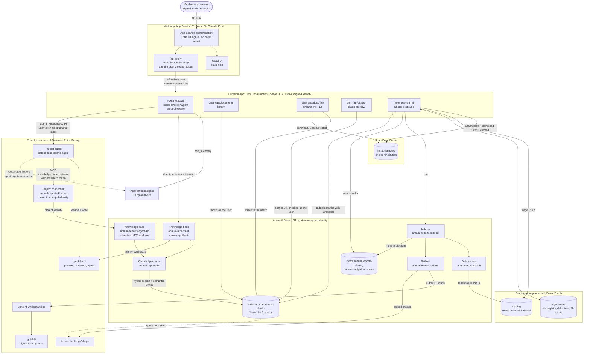
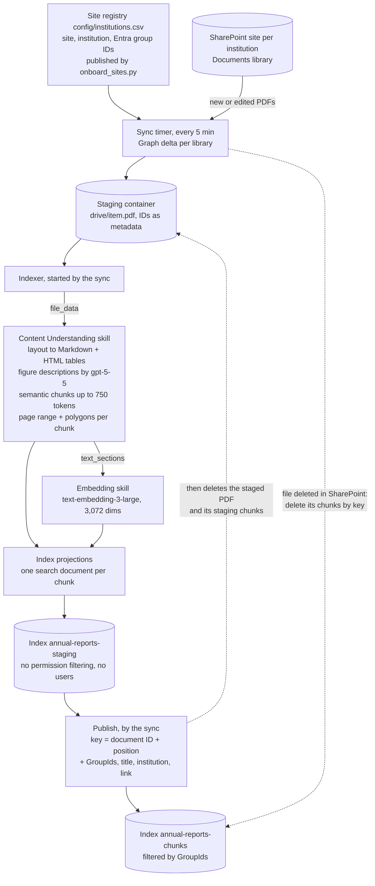
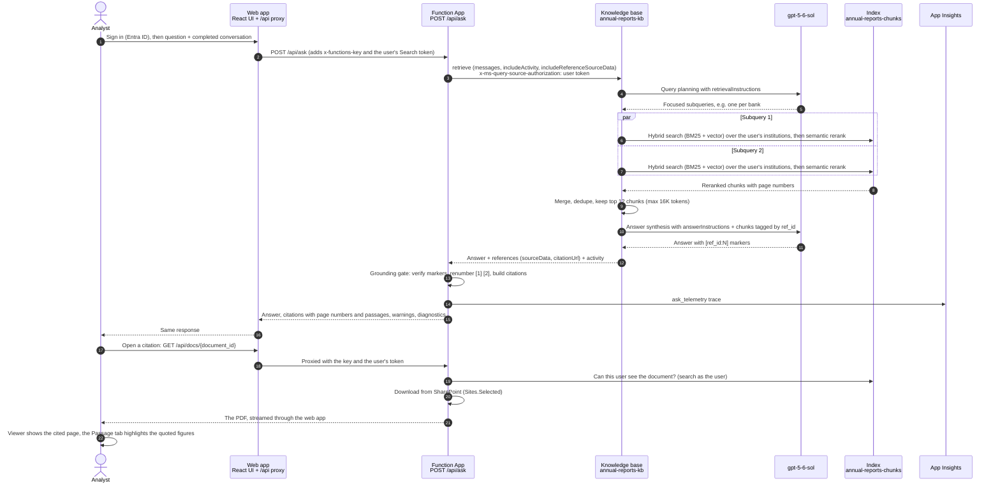
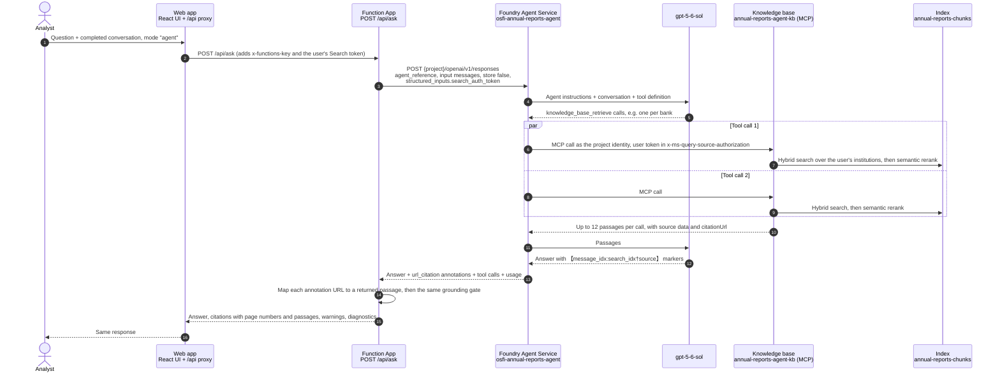

# OSFI RAG POC: citation-grounded Q&A over annual reports

Answers questions about Canadian bank and credit-union annual reports. Every claim in an answer cites the PDF page it came from, and each citation opens the PDF at that page. How it works:

- The reports live in SharePoint, one site per institution. A sync job in the Function App copies new and edited PDFs through a short-lived staging container into Azure AI Search, and deletes the chunks of files deleted in SharePoint.
- Azure AI Search ingests the PDFs. The Content Understanding skill chunks them and records the page each chunk came from.
- Users sign in with Microsoft Entra ID. Answers, citations, passages, PDFs and the library only ever include the institutions whose SharePoint site the user's groups can access.
- Answers come from one of two [answer modes](#answer-modes), chosen in the UI:
  - **Direct retrieval:** a Foundry IQ knowledge base retrieves chunks and writes the answer.
  - **Foundry Agent:** a Foundry Agent Service prompt agent searches a Foundry IQ knowledge base through its MCP tool and writes the answer itself.
- An Azure Function checks every citation before returning the answer, in both modes.
- A React web app ([web/](web/)) shows each answer next to the cited PDF page and the exact passage it came from, and has a technical specification page for each mode.

**To deploy, follow the [deployment runbook](documentation/osfi-dev-deployment-runbook.md).** It has every step for the Azure subscription Owner and the Global Administrator, and covers day-to-day operations, monitoring, troubleshooting and teardown.

**Contents:** [Architecture](#architecture) · [Data flow](#data-flow) · [Answer modes](#answer-modes) · [How the RAG pipeline works](#how-the-rag-pipeline-works) · [Web UI](#web-ui) · [Repository layout](#repository-layout) · [Deploy, run and test](#deploy-run-and-test) · [API](#api) · [Design decisions](#design-decisions) · [Known issues](#known-issues) · [Future options](#future-options) · [Cost and teardown](#cost-and-teardown)

## Architecture



All resources are in resource group `rg-osfi-rag-poc`. Everything runs in Canada Central except the web app, which runs in Canada East by default (`webAppLocation` in [infra/main.bicepparam](infra/main.bicepparam)) for subscriptions without App Service quota in Canada Central. Every service-to-service call uses Microsoft Entra ID with managed identities. The only secret is the function key, which the web app's server adds to `/api` calls, so it never reaches the browser; the sign-in uses a managed identity instead of a client secret. The operator's path (sites, sync and indexing) is in [Data flow](#data-flow).

### What's deployed (`infra/`, Bicep)

| Resource | Notes |
|---|---|
| Azure AI Search **S1** | System-assigned identity, semantic ranker. S1 because Basic caps source files at 16 MB, which some annual reports exceed. |
| Foundry resource (AIServices) + project | `gpt-5-6-sol` (knowledge base and the Foundry agent), `gpt-5-5` (Content Understanding figure descriptions; CU doesn't support 5.6 yet), `text-embedding-3-large`. All GlobalStandard, which is the only SKU offered in Canada Central. The project holds the prompt agent `osfi-annual-reports-agent` (created by `scripts/setup_agent.py`), the `RemoteTool` connection `annual-reports-kb-mcp` its knowledge base tool authenticates through, and the `AppInsights` connection `app-insights` that turns on Foundry's server-side tracing of agent runs. |
| Storage | `function-releases` (Function App package and host state). Entra ID only (no keys). |
| Staging storage | `staging` (each PDF only until its chunks are published) and `sync-state` (site registry, delta links, per-file status) ([infra/modules/staging.bicep](infra/modules/staging.bicep)). Blob soft delete, container soft delete and versioning off, so a deleted staged file is gone; a lifecycle rule deletes anything staged for more than a day. Entra ID only. |
| Function App | Flex Consumption, Python 3.12, user-assigned identity. The API and the 5-minute SharePoint sync. |
| Web app | App Service plan B1 (Linux) in **Canada East**, Node 24, running [web/server.mjs](web/server.mjs): the React build plus an `/api` proxy. App Service authentication (Entra ID) signs users in through the app registration `osfi-rag-poc-web`, which trusts the web app's user-assigned identity through a federated credential instead of a client secret. Basic-auth publishing is off; deployments use Entra ID. |
| Log Analytics + App Insights | Telemetry from `/api/ask`, request telemetry from the web app, and Foundry's server-side traces of agent runs |
| Role assignments | See [Identities and roles](#identities-and-roles) |

### Identities and roles

| Caller | Identity | Target | Roles | Used for |
|---|---|---|---|---|
| AI Search (indexer, skills, knowledge base) | System-assigned | Staging storage | Storage Blob Data Reader | Reading staged PDFs |
| | | Foundry | Cognitive Services User, Cognitive Services OpenAI User | Content Understanding, embeddings, query planning and answers |
| Function App | User-assigned | AI Search | Search Index Data Reader, Search Index Data Contributor, Search Service Contributor | Retrieval and `citationUrl` lookups as the user, reading the staging index, publishing and deleting chunks, running the indexer |
| | | Microsoft Graph | `Sites.Selected` application permission, with read on each registered site | SharePoint delta queries and downloads, and streaming PDFs to users |
| | | Staging storage | Storage Blob Data Contributor | Staged PDFs and sync state |
| | | Foundry | Foundry User | Running the Foundry agent (Responses API) |
| | | Storage | Storage Blob Data Owner | Functions host storage and deployment package |
| Foundry project (the agent's knowledge base tool) | System-assigned, through the `annual-reports-kb-mcp` connection | AI Search | Search Index Data Reader | Calling the agent knowledge base's MCP endpoint (with the user's token in a header) |
| Web app server | User-assigned (`id-web-…`) | App registration `osfi-rag-poc-web` | Federated credential | Signing users in without a client secret |
| | None | Function App | Function key (app setting `API_KEY`) | Proxying `/api` calls from the browser |
| Signed-in user | Delegated, through `osfi-rag-poc-web` (tenant-wide admin consent) | AI Search | `user_impersonation` | The Search token the API sends with every query; Search returns only chunks whose `GroupIds` include one of the user's groups |
| Deploying user | `az login` | AI Search, Foundry, Storage, staging storage | Search Index Data Reader and Contributor, Search Service Contributor, Cognitive Services User, Cognitive Services OpenAI User, Foundry User, Storage Blob Data Contributor | Setup, onboarding and test scripts |

## Data flow

### Ingestion



The sync's managed identity can't query the chunk index: permission filtering hides every chunk from an app-only token, and Search refuses it an elevated read. That's why the indexer writes to a separate staging index, and why the sync derives each chunk's key from the SharePoint item ID and the chunk's position and keeps each document's chunk count in its state: it updates and deletes chunks by key, never by query. Details are in [rag/sync.py](src/function_app/rag/sync.py).

### Question answering: Direct retrieval



### Question answering: Foundry Agent



## Answer modes

The composer's **Direct retrieval / Foundry Agent** switch chooses how the next question is answered; every answer is labelled with the mode that produced it. Both modes search the same index through the same knowledge source, and both pass through the same grounding gate, so citations always carry a verified PDF page and passage. The web app has a technical specification page for each mode at `/how-it-works/direct` and `/how-it-works/agent` (content in [web/src/lib/specs.ts](web/src/lib/specs.ts), checked against the configuration files by `web/src/lib/specs.test.ts`).

| | Direct retrieval (`mode: "direct"`, the default) | Foundry Agent (`mode: "agent"`) |
|---|---|---|
| Orchestration | The Function makes one `retrieve` call; the knowledge base runs a fixed sequence | Foundry Agent Service; the agent decides what to search and how often |
| Query planning | Knowledge base planner, `gpt-5-6-sol` at `low` effort | The agent (`gpt-5-6-sol`, `low` reasoning effort), one tool call per information need |
| Knowledge base | `annual-reports-kb`, answer synthesis ([search/knowledge-base.json](search/knowledge-base.json)) | `annual-reports-agent-kb`, extractive data, minimal reasoning ([search/knowledge-base-agent.json](search/knowledge-base-agent.json)) |
| Writes the answer | The knowledge base | The agent |
| Prompt | `retrievalInstructions` and `answerInstructions` inside a Microsoft-managed prompt | [agent/instructions.md](agent/instructions.md), versioned with the agent |
| Citations | `[ref_id:N]` in the knowledge base's answer | `url_citation` annotations that Foundry adds for each `【message_idx:search_idx†source】` marker |
| Diagnostics | Per-stage timings and tokens from the knowledge base's activity log | Agent version, each tool call's query and passage count, token usage, total time (per-step timings are in the Foundry traces) |
| Stored server-side | Nothing | Nothing in Foundry (`store: false`); run traces, with inputs and outputs, in Application Insights |

### How Foundry Agent mode works

- **Agent.** `osfi-annual-reports-agent` is a prompt agent: `gpt-5-6-sol`, reasoning effort `low`, the instructions in [agent/instructions.md](agent/instructions.md) and one MCP tool, all defined in [agent/agent.json](agent/agent.json). [scripts/setup_agent.py](scripts/setup_agent.py) creates a new immutable agent version whenever that definition changes, and the API always runs the latest version.
- **Tool.** The MCP tool allows only `knowledge_base_retrieve`, without an approval step, on the MCP endpoint of `annual-reports-agent-kb`. Its input is one standalone natural-language question (`{"query_variants": ["..."]}`); the agent makes one call per institution or fiscal year and runs them in parallel.
- **Authentication.** The tool authenticates through the Foundry project connection `annual-reports-kb-mcp` (category `RemoteTool`, `ProjectManagedIdentity`, audience `https://search.azure.com/`), defined in [infra/modules/foundry.bicep](infra/modules/foundry.bicep). The project's system-assigned identity has Search Index Data Reader on the search service. The Function runs the agent with its own identity (Foundry User).
- **Knowledge base.** `annual-reports-agent-kb` uses the same knowledge source as Direct retrieval but returns passages only (`outputMode: extractiveData`) and plans nothing itself (`retrievalReasoningEffort: minimal`), so the agent reasons over the passages rather than over a pre-written answer. Each call returns up to 12 passages and 16,000 tokens, with the same source data and `citationUrl` as Direct retrieval.
- **Citations.** The agent cites passages as `【message_idx:search_idx†source】`. Foundry Agent Service turns each marker into a `url_citation` annotation whose URL is the passage's `citationUrl`, and each tool call's output lists its documents with that URL and their source data. [rag/agent.py](src/function_app/rag/agent.py) matches the annotations to the documents, rewrites each marker as `[ref_id:call.document]` and hands the answer to the unchanged grounding gate. Markers without a matching document are removed and reported, as in Direct retrieval.
- **Warnings.** The API warns when the agent answered without calling the knowledge base, when a tool call failed (reported as HTTP 206, like a partial retrieval) and when the run didn't complete.
- **Conversation.** The conversation is sent as Responses API input messages with `store: false`, so nothing is kept in Foundry. Its budget is 786,000 tokens: the model's 922,000-token input window minus 128,000 tokens for tool results (about 16,000 per call) and 8,000 for instructions. Foundry's server-side traces of each run, which include the conversation, the passages and the answer, go to Application Insights and follow the workspace's 30-day retention.
- **Cost and latency.** The agent's model reads every returned passage itself, so a comparison of two banks uses about 33,000 input tokens, against about 11,000 for Direct retrieval. In testing, agent answers took 5–11 s.

The agent can also be tried in the Foundry portal's agent playground; `setup_agent.py` prints the link.

## How the RAG pipeline works

### 1. Chunking

**Method:** layout-aware semantic chunking by the Content Understanding skill (skill `extract-and-chunk` in [search/skillset.json](search/skillset.json)). The skill receives the original PDF (`/document/file_data`) and does three things:

1. **Layout analysis.** It reads every page's structure (reading order, headings, paragraphs, tables, figures) and converts it to Markdown.
   - Tables become HTML `<table>` markup, so rows, columns and merged cells survive.
   - Charts and photos become a text description written by `gpt-5-5`, inlined as Markdown image alt text. For example: ``.
2. **Semantic chunking** with `chunkingProperties: { method: "semantic", unit: "tokens", maximumLength: 750 }`.
   - Chunks break at structural boundaries (sections, paragraphs, tables), not every N characters, up to about 750 tokens.
   - No overlap is configured.
   - A table that continues across a page break stays in one chunk, so a chunk can span pages.
3. **Provenance.** `extractionOptions: ["locationMetadata"]` attaches to each chunk:
   - its page range (`pageNumberFrom`/`pageNumberTo`, the PDF page index rather than the printed page number);
   - its position in the document (`ordinalPosition`);
   - bounding polygons.

Page numbers come from the layout analysis, not from numbers printed on the page, which is what makes citations checkable. `scripts/verify_pages.py` matched 40 of 40 sampled chunks to the right PDF page.

For six bank annual reports (1,297 pages):

| Metric | Value |
|---|---|
| Chunks | 3,535 (TD 726, Scotiabank 689, RBC 670, CIBC 604, BMO 570, Alterna 276) |
| Chunk size | Median 1,944 characters (~230 words), mean 2,187, 95th percentile 3,749 |
| Largest chunk | 10,932 characters, a single dense table (RBC p. 224) |
| Chunks spanning 2+ pages | 1,193 (34%), cited as "p. X–Y" |
| Chunks containing a table | 2,025 (57%) |
| Chunks with a figure description | 252 |

**Are we doing parent-child chunking?** Structurally yes; at retrieval time, no.

- **Yes, structurally.** Index projections split each PDF (the parent) into chunk rows (the children).
  - Every chunk stores `document_id` (the SharePoint item ID) plus copies of the parent's fields (`doc_title`, `institution`, `fiscal_year`, `source_file`, `source_url`, `last_modified`), so a chunk can be filtered and cited without a join.
  - The parent document isn't indexed on its own (`projectionMode: skipIndexingParentDocuments`).
- **No, at retrieval time.** It isn't hierarchical "small-to-big" retrieval, where the search matches small child chunks and then sends their larger parent section to the model. The model reads the same chunks the search returns.
- **Adding context later.** If evaluation shows answers need more surrounding context, neighbouring chunks can be fetched with `document_id` + `ordinal_position` ("sibling-chunk expansion"). That means switching the knowledge base to extractive output and generating the answer in the Function.

### 2. Indexing

The indexer ([search/indexer.json](search/indexer.json)) reads the PDFs the sync staged in the `staging` container ([search/datasource.json](search/datasource.json)), runs the skillset, and writes chunks to the staging index `annual-reports-staging` ([search/staging-index.json](search/staging-index.json)) through index projections. The sync then publishes each document's chunks to `annual-reports-chunks` ([Data flow](#ingestion)).

| Setting | Value | Why |
|---|---|---|
| Connection | `ResourceId=` connection string, search service's managed identity | No storage keys |
| Change detection | Blob last-modified timestamp (built in) | An edited file is staged again under the same name and reprocessed |
| Deletion detection | None | The sync deletes a staged file once its chunks are published, so deleting it must not delete chunks. Files deleted in SharePoint lose their chunks through the sync |
| File types | `.pdf` only | |
| `allowSkillsetToReadFileData` | `true` | Gives Content Understanding the original file |
| `batchSize`, `maxFailedItems`, `maxFailedItemsPerBatch` | 1, -1, -1 | A slow 250-page report can't fail the others, and one bad file never stops a run; the sync reports per-file errors |
| Schedule | None | The sync starts a run whenever files are waiting. `scripts/indexer.py --run` starts one by hand |

The skillset has two skills:

- **Content Understanding**, described in [Chunking](#1-chunking).
- **Azure OpenAI Embedding skill**: `text-embedding-3-large`, 3,072 dimensions, run on each chunk.

The skills run, and are billed, on the Foundry resource through the search service's identity (`AIServicesByIdentity`). A 250-page report takes about 4–5 minutes; in testing, four annual reports took 9 minutes in one run.

The index `annual-reports-chunks` ([search/index.json](search/index.json)) holds one search document per chunk, written by the sync:

| Group | Fields | Notes |
|---|---|---|
| Key | `chunk_id` | The SharePoint item ID (base64url) and the chunk's position in the document, so the sync can replace or delete chunks without querying |
| Sync fields | `document_id`, `drive_id`, `institution_key`, `source_version` | The SharePoint item, library, institution and file version (eTag) |
| Permissions | `GroupIds`, `UserIds` | `permissionFilter` fields, not retrievable. `GroupIds` holds the Entra groups of the institution's site from the registry; `UserIds` stays empty. A chunk without values is visible to no one |
| Document fields, repeated on each chunk | `doc_title`, `institution`, `fiscal_year`, `source_file`, `source_url`, `last_modified` | `doc_title` is the library's Title column, or the file name. `institution` comes from the registry, `fiscal_year` from the first 20xx in the title or file name, and `source_url` is the SharePoint link |
| Content | `chunk_text` | Markdown with HTML tables. Searchable with the `en.microsoft` analyzer. |
| Vector | `chunk_vector` | 3,072 dimensions, HNSW (cosine, m 4, efConstruction 400, efSearch 500). The `aoai-vectorizer` embeds queries with the same deployment. |
| Provenance | `page_number_from`, `page_number_to`, `ordinal_position`, `bounding_polygons`, `image_path` | From `locationMetadata` |

The staging index has the same content, provenance and sync fields with retrievable vectors, and no permission fields or display fields. No user, knowledge base or agent queries it.

The semantic configuration `annual-reports-semantic` uses `doc_title` as the title, `chunk_text` as content and `institution` as keywords.

The knowledge source `annual-reports-ks` ([search/knowledge-source.json](search/knowledge-source.json)) wraps the index:

- Keyword search runs over `chunk_text`.
- Every reference returns `chunk_id`, `doc_title`, `institution`, `fiscal_year`, `page_number_from`, `page_number_to`, `source_file`, `source_url`, `document_id`, `chunk_text` and `bounding_polygons` as `sourceData`.

### 3. Search and reranking

`POST /api/ask` in Direct retrieval mode calls the knowledge base's `retrieve` action ([search/knowledge-base.json](search/knowledge-base.json)). This is Foundry IQ agentic retrieval, and it runs inside Azure AI Search in four steps:

1. **Query planning.** `gpt-5-6-sol` (reasoning effort `low`) reads the conversation within the model's context budget, the new question, and the `retrievalInstructions`, then writes focused subqueries.
   - A comparison question becomes one subquery per institution.
   - Because the history is included, a follow-up question gets its missing context filled in from earlier turns.
2. **Hybrid search, in parallel.** Each subquery runs against the index as a hybrid query, merged with Reciprocal Rank Fusion:
   - BM25 keyword search over `chunk_text` catches exact terms such as "CET1" and figures;
   - vector search over `chunk_vector` catches paraphrases (the vectorizer embeds the subquery).
3. **Semantic reranking.** Yes, results are reranked. The semantic ranker, a cross-encoder model, rescores the top results of each subquery (up to 50). It reads `doc_title`, `chunk_text` and `institution` together with the subquery and scores each result from 0 to 4 (`rerankerScore`).
4. **Merge.** Results from all subqueries are merged, deduplicated and ordered by reranker score. The `retrieveDefaults` cap the output at 12 chunks and 16,000 tokens, with a 45-second runtime limit.

There's no third-party reranker. No filters are added by the app: the planner scopes by institution through the query text, and Azure AI Search adds the permission filter for the user's groups to every query.

The trace for *"Compare the CET1 ratios of RBC and TD at the end of fiscal 2025"* (from `includeActivity`):

| Step | Result |
|---|---|
| Query planning | 1.8 s, 1,286 input and 89 output tokens. Two subqueries: "Royal Bank of Canada RBC fiscal 2025 year-end CET1 ratio October 31 2025" and "Toronto-Dominion Bank TD fiscal 2025 year-end CET1 ratio October 31 2025" |
| Hybrid search + semantic reranking | 42 and 46 candidates |
| Merge | 12 chunks, reranker scores from 3.46 down to 2.00 |
| Answer synthesis | 2.9 s, 9,360 input and 163 output tokens |
| Agentic reasoning tokens (billed by AI Search) | 62,074 |
| Answer | RBC 13.5% [1], TD 14.7% [2] |

### 4. Final answer

In Direct retrieval mode the knowledge base writes the answer itself (`outputMode: answerSynthesis`), using `gpt-5-6-sol` at `low` reasoning effort. The Function doesn't call a model and sends no system message of its own. Its retrieve request carries only:

- the conversation (user and assistant messages);
- retrieval options (`includeActivity`, `includeReferences`, `includeReferenceSourceData`).

**Prompts.** Azure AI Search wraps a Microsoft-managed prompt around two instruction fields that we control in [search/knowledge-base.json](search/knowledge-base.json). The managed prompt can't be viewed or edited.

| Field | Used in | Our text |
|---|---|---|
| `retrievalInstructions` | Query planning | "All content is annual reports from Canadian financial institutions. When a question names an institution or fiscal year, scope the search to it." |
| `answerInstructions` | Answer synthesis | "Answer only from the retrieved sources. Cite every factual claim with [ref_id:N]. Quote exact figures — never round or restate. If the sources do not contain the answer, say so explicitly rather than inferring. Never cite a page number that appears inside the document text; cite only the retrieved source." |

The last instruction is there because reports print their own page references (tables of contents, "see page 54"), and those don't match the PDF page a chunk came from.

The model sees the conversation, the instructions and the top-ranked chunks, each tagged with a `ref_id`. It returns an answer containing `[ref_id:N]` markers. Alongside the answer, the knowledge base returns:

- `references[]`, each with `sourceData`, `citationUrl` and `rerankerScore`;
- the `activity` trace.

Temperature and max tokens aren't exposed, so length and style are steered through `answerInstructions`. To change a prompt, edit the JSON and run `scripts/setup_search.py --skip-indexer`; the next request uses the new text.

**Grounding gate** ([src/function_app/rag/grounding.py](src/function_app/rag/grounding.py)). Before anything reaches the user, the Function:

1. Resolves every `[ref_id:N]` against the returned references.
2. Removes and reports (in `warnings`) any marker that matches no retrieved chunk, or whose chunk has no `doc_title` or `page_number_from`. The UI never shows "page undefined".
3. Renumbers the remaining markers `[1]`, `[2]`… in order of first use.
4. Builds one citation per source:
   - label, for example "Royal Bank of Canada Annual Report 2025 — p. 238";
   - link `/api/docs/<document_id>#page=N`, which streams the PDF from SharePoint once the API has checked that the user can see that document, so the viewer opens at that page;
   - excerpt, bounding polygons and `citationUrl`.
5. Computes `grounded_sentence_ratio`, the share of claim-like sentences that carry a citation. It's a heuristic, and framing sentences count against it.
6. Logs an `ask_telemetry` record (per-stage latency and tokens, gate result) to Application Insights.

If a fully custom system message is needed later, for example for a fixed answer template, switch the knowledge base to `outputMode: extractiveData` and have the Function call `gpt-5-6-sol` with its own prompt over the returned chunks. Foundry Agent mode already works this way, with the agent's instructions as the system message.

## Web UI

The React app in [web/](web/) (Vite, TypeScript, Tailwind CSS) is built for checking answers quickly:

- **Conversation-first layout.** Questions appear in right-aligned bubbles, with readable assistant responses below. The composer stays available while the conversation scrolls independently, follows new answers unless the reader has scrolled up, and offers a "Latest message" shortcut.
- **Answer mode switch.** A **Direct retrieval / Foundry Agent** switch in the composer chooses the mode for the next question; the choice is remembered in the browser. Each answer is labelled with the mode that produced it, and Try again reuses that mode. The info button next to the switch opens the selected mode's specification.
- **Technical specifications.** `/how-it-works/direct` and `/how-it-works/agent` describe each mode: key facts, the request path, the request lifecycle step by step, configuration, the exact prompts, citation verification, conversation handling, identities and roles, diagnostics, strengths and limitations, and a side-by-side comparison. They're linked from the switch, the mode label on each answer and the start page.
- **OSFI research workspace.** A restrained blue-and-neutral header uses the [official OSFI logo](https://www.osfi-bsif.gc.ca/themes/custom/osfi_wxt/logo.svg), bundled locally in [web/public/osfi-logo.svg](web/public/osfi-logo.svg). Microsoft Foundry and Foundry IQ appear as subtle footer credits. The interface is explicitly labeled a research preview, not official OSFI guidance; organizational branding approval is still required before public distribution.
- **Citation chips.** Each `[n]` in an answer is a chip. Hover it to preview the source with the quoted figures highlighted; click it to open the source.
- **Source viewer.** Its default height fills the workspace with a 20px inset above and below, ending just above the footer. Drag its left or bottom edge to resize width or height; keyboard users can focus either separator and use arrow keys, Home, or End. Expand fills more of the workspace; Restore returns to the chosen dimensions. Collapse gives the conversation its space back, and **Show sources** reopens the same document and tab without discarding the draft question. On small screens it becomes a nearly full-screen modal with contained keyboard focus. Two tabs are available:
  - **Page** shows the PDF at the cited page. Switching between citations in the same report jumps pages without downloading the file again.
  - **Passage** shows the exact chunk the answer was written from, tables included, scrolled to the highlighted figures.
- **Sources list** under each answer. Source cards are collapsed by default behind a **Sources** disclosure; inline citations remain available without expanding the list. A "sources linked" label appears when the grounding gate passed; it means citation-to-passage matching, not verification of the answer's accuracy. Plain-language notices appear when citations were removed or retrieval was incomplete.
- **Responsible AI.** Every answer is labeled AI-generated, and a persistent composer disclaimer asks readers to verify original sources. **Responsible AI** opens information about errors and limitations, human review, appropriate data sharing, browser-local chat history, and Microsoft's Responsible AI principles. These disclosures do not claim certification or compliance.
- **How this answer was found**:
  - the subqueries the planner wrote (Direct retrieval), or each knowledge base call the agent made with its passage count (Foundry Agent);
  - a compact retrieval timeline with measured planning/writing durations and separately labeled remaining service time (not a claim of measured search latency); Foundry Agent Service reports only a total;
  - passages retrieved versus cited;
  - expandable technical details for token counts, heuristic sentence checks, conversation context when the API reports it, and the agent version and Foundry response ID in agent mode.
- **Library**: every report, its passage count and which files failed to index. Any report can be opened from the header Library control; the landing page does not duplicate this list.
- **Everyday controls**:
  - the conversation survives a reload (browser local storage), with no fixed turn-count cap; a visible warning appears if storage is full or unavailable;
  - follow-up questions carry all completed exchanges that fit the model and transport budgets, rather than only the last six messages;
  - Stop and Try again;
  - Copy (the answer plus its source list);
  - keyboard shortcuts: Enter to ask, Shift+Enter for a new line, `/` to focus the question box, Esc to close the viewer.
  - reduced-motion preferences, keyboard-operable source tabs, and visible focus indicators are supported.

### Conversation context and limits

The configured model is GPT-5.6 Sol (`CHAT_MODEL=gpt-5.6-sol`, deployment `gpt-5-6-sol`). Its documented context window is 1,050,000 tokens, including up to 922,000 input tokens and 128,000 output tokens ([Microsoft model capabilities](https://learn.microsoft.com/azure/foundry/foundry-models/concepts/models-sold-directly-by-azure#gpt-56)).

[rag/conversation.py](src/function_app/rag/conversation.py) uses the model's `o200k_base` tokenizer, with a conservative **898,000-token conversation budget**, including the new question. This reserves 16,000 tokens for retrieved content (matching the knowledge base configuration) and another 8,000 for service-managed instructions and overhead. The API retains a contiguous suffix of whole exchanges when the budget is exceeded; it never slices individual answer text. It reports omitted-message counts in both a visible warning and `diagnostics.conversation`. Earlier messages remain in the visible chat. These are estimated input counts, not billed token usage; actual service usage remains in the retrieval diagnostics.

The browser and production proxy accept up to **16 MiB** per request. The browser trims only whole oldest exchanges if necessary to fit UTF-8 JSON transport size, and the API separately budgets its serialized retrieve payload below Azure AI Search's 16 MB request limit. Neither layer uses a fixed message count. `question` still has its existing 2,000-character limit.

Set `CONVERSATION_TOKEN_BUDGET` on the API to a smaller positive value if a deployment has tighter limits or needs a lower cost/latency ceiling. The current maximum is 898,000; Foundry Agent mode caps it at 786,000 to leave room for tool results. Changing models or the knowledge base's retrieved-context size requires reviewing these budgets. Very long histories increase model token usage and latency. Browser persistence is subject to the browser's storage quota, not the model's context window; if saving fails, chatting can continue in memory, but newer messages may not survive a reload.

[web/server.mjs](web/server.mjs) serves the build and proxies `/api/*` to the Function App, adding the function key on the server. It:

- forwards the signed-in user's Azure AI Search token, which App Service authentication passes in `x-ms-token-aad-access-token`, as `x-search-user-token` (locally, `LOCAL_USER_TOKEN=az` uses your `az login` token instead);
- uses only Node built-ins, so the deployment has no `node_modules`;
- precompresses assets with Brotli and gzip;
- sends a Content Security Policy that allows framing PDFs from its own origin only.

When the API answers 401 because the Search token expired, the UI refreshes the sign-in (`/.auth/refresh`) and retries once.

## Repository layout

| Path | Contents |
|---|---|
| `infra/` | Bicep: `main.bicep` (subscription scope) plus modules for monitoring, storage, staging storage, search, Foundry (including the agent's project connection), the Function App, the web app (with sign-in) and role assignments. |
| `config/` | `institutions.csv`, the site registry: one row per institution with its SharePoint site and the Entra groups that grant access |
| `search/` | AI Search object definitions: data source, chunk index, staging index, skillset, knowledge source, the two knowledge bases and the indexer. `${VAR}` placeholders are filled from `.env`. |
| `agent/` | The Foundry agent: `agent.json` (model, reasoning effort, MCP tool with the user-token header) and `instructions.md` (its system prompt), applied by `scripts/setup_agent.py` |
| `src/function_app/` | Function App: `function_app.py` (routes and the sync timer), `rag/` (search client, user-token checks, SharePoint client, staging store, sync, Foundry agent client, grounding gate, PDF streaming, telemetry) |
| `web/` | React UI (`src/`, including the specification pages), its unit and browser tests (`npm test`, `npm run test:e2e`) and the production server (`server.mjs`) |
| `scripts/` | Deployment, setup, SharePoint onboarding, operations, local development and test scripts; the runbook's [Appendix A](documentation/osfi-dev-deployment-runbook.md#appendix-a-script-parameters) describes those it uses |
| `tests/` | API unit tests: grounding gate, conversation budgets, agent response parsing, both answer modes, user-token checks, the search client, onboarding and the SharePoint sync |
| `documentation/` | The [deployment runbook](documentation/osfi-dev-deployment-runbook.md) |

## Deploy, run and test

To deploy, follow the [deployment runbook](documentation/osfi-dev-deployment-runbook.md): every step for the Azure subscription Owner and the Global Administrator, from installing the tools to the smoke test, then day-to-day operations, monitoring, troubleshooting and teardown.

- **Local development.** Every local mode uses the deployed Azure resources (search, models, storage) with your `az login` identity, and sends your own Azure AI Search token, so you see the institutions your groups can access:

  | Mode | Commands | Open |
  |---|---|---|
  | UI locally, API in Azure (fastest for UI work) | `./scripts/dev_web.ps1` | http://localhost:5173 (hot reload) |
  | UI and API both locally | `./scripts/dev_api.ps1` in one terminal, then `./scripts/dev_web.ps1 -LocalApi` in another | http://localhost:5173; the API runs on port 7071 |
  | Production build, as it runs in Azure | `./scripts/dev_web.ps1 -Production` (add `-LocalApi` for the local API) | http://localhost:8080 |

  `scripts/ask.py --local "<question>"` runs the API code from your clone on your machine, without the UI.

- **Tests.**
  - `.venv/Scripts/python -m pytest tests`: the grounding gate, conversation budgets, both answer modes, user-token checks and the SharePoint sync.
  - `npm test` and `npm run test:e2e` in `web/`: the UI helpers, the specification pages' configuration check, and browser tests (run `npx playwright install chromium` once first).
  - `.venv/Scripts/python scripts/smoke_test.py`: checks against the deployed API and web app.

## API

Every route needs the function key (`x-functions-key`) and the signed-in user's Azure AI Search token (`x-search-user-token`, the bare token). Without a valid user token the API answers 401 with a `code`: `sign_in_required`, `invalid_token` (wrong audience, or Search rejected it) or `token_expired`. The token decides what every route can return: only chunks whose `GroupIds` include one of the user's groups.

`POST /api/ask` with body `{"question": "...", "history": [{"role": "user|assistant", "text": "..."}], "mode": "direct|agent"}` returns the fields below. `mode` defaults to `direct`; `agent` returns 503 if the API has no `FOUNDRY_PROJECT_ENDPOINT` and `AGENT_NAME` settings.

- `mode`: the mode that answered.
- `answer`: `[ref_id:N]` markers (or, in agent mode, the annotated `【…】` markers) rewritten as `[1]`, `[2]`… Markers that don't resolve, or whose source has no title or page, are stripped and reported.
- `citations[]`: `label` ("RBC … — p. 47–48"), `page_from`/`page_to`, `document_id`, `source_url` (the SharePoint link), `link` (`/api/docs/<document_id>#page=N`), `citation_url`, `excerpt`, `bounding_polygons`.
- `warnings[]`, `diagnostics` (mode, gate result, grounded-sentence ratio, per-stage latency and tokens). In agent mode, `diagnostics.agent` has the agent name, version, model deployment, run status, Foundry response ID and tool call count, and `diagnostics.activity` has one `knowledgeBaseCall` entry (query, passages returned, status, error) per tool call.

`GET /api/documents` lists the documents the user can see, from the index: `file` (the document ID), `title`, `institution`, `fiscal_year`, `last_modified` and `chunks`. Files the sync couldn't index aren't listed; `scripts/sync.py` shows them.

`GET /api/docs/{document_id}` streams the PDF from SharePoint, after a search with the user's token shows they can see the document (404 otherwise). Add `?format=json` to get `{"url", "expires_in"}` instead; the UI's PDF viewer uses this and appends `#page=N`.

`GET /api/citation?url=<citationUrl>` returns the indexed chunk behind a citation, if the user can see it.

Through the web app, call the same paths without a key or token; its server adds both.

The timer function `sharepoint_sync` runs every 5 minutes. It reads the site registry, applies each library's changes from Microsoft Graph, starts the indexer when files are staged, and publishes finished files. Its summary goes to Application Insights:

```kusto
traces
| where message startswith "sharepoint_sync"
| project timestamp, summary = parse_json(substring(message, 16))
```

Telemetry query (App Insights → Logs):

```kusto
traces
| where message startswith "ask_telemetry"
| extend m = parse_json(substring(message, 14))
| project timestamp, mode = tostring(m.mode), elapsed_ms = toint(m.elapsed_ms), gate_passed = tobool(m.gate_passed),
          grounded = todouble(m.grounded_sentence_ratio), citations = toint(m.citation_count),
          unresolved = array_length(m.unresolved_ref_ids)
```

Foundry also traces every agent run itself into the same Application Insights, through the project connection `app-insights`: an `invoke_agent` span with the conversation and answer, an `execute_tool` span per knowledge base call with its query and passages, and a `chat` span per model call with token usage. Their `cloud_RoleName` is `responsesapi`, and `gen_ai.response.id` matches an answer's `diagnostics.agent.response_id`. Open them in the Foundry portal under Agents → `osfi-annual-reports-agent` → Traces.

## Design decisions

- **SharePoint through a sync job, not the SharePoint indexer.** The native indexer is documented as unsupported with Conditional Access and needs one data source per site. The sync keeps the tested Blob-based Content Understanding pipeline; a file is in Azure Storage only while it's being indexed.
- **Access per institution, from a registry.** Every chunk of an institution carries the Entra groups that grant access to its site, from `config/institutions.csv`. Per-file SharePoint permissions aren't read.
- **No on-behalf-of exchange.** The sign-in asks for an Azure AI Search token directly (`user_impersonation` scope), and the web server forwards it. PDFs are streamed by the Function's identity (`Sites.Selected`) after a search with the user's token confirms the user can see the document, rather than with a delegated Graph token.
- **One 5-minute timer, no queue.** Sites sync one after another, capped at 25 files per run (`SYNC_MAX_FILES_PER_RUN`). Several hundred sites need a queue that syncs several sites at once; see [Before production](documentation/osfi-dev-deployment-runbook.md#49-before-production) in the runbook.
- **Models:** `gpt-5.6-sol` for the knowledge bases and the agent; `gpt-5.5` for figure descriptions, because Content Understanding doesn't support 5.6 yet.
- **The Foundry agent calls the knowledge base directly**, over MCP, rather than calling `/api/ask` as its tool. Foundry Agent Service returns every tool call's documents (with their source data) and a `url_citation` annotation per citation, so the Function can still verify each citation against the passages the agent received. The agent uses its own extractive knowledge base, and Direct retrieval remains available alongside it.
- **Content Understanding** runs with `extractionOptions: ["locationMetadata"]` only. Figure descriptions don't need image extraction, and skipping it keeps the enrichment payload small.
- `fiscal_year` is a string, derived from the title or file name.

## Known issues

- The sync handles PDFs only, up to the S1 indexer's 128 MB limit. Other files are ignored, and larger PDFs are reported as failed in `scripts/sync.py`.
- SharePoint changes reach answers after the next sync run (up to 5 minutes) plus indexing time (about 4–5 minutes for a 250-page report).
- Access follows the site's groups in the registry. Files with narrower permissions inside a site, sharing links and SharePoint-only groups aren't reflected.
- The sync's identity can't query the chunk index. If its state in `sync-state` is lost, chunks of files deleted meanwhile stay in the index; an operator can find them with an elevated read (`scripts/indexer.py`) and delete them.
- The 200–250 page reports take about 4–5 minutes each in Content Understanding, which is close to its 5-minute limit.
- Answers take about 5–25 s with `gpt-5.6-sol` and `low` reasoning effort.
- Foundry Agent mode relies on preview features: `RemoteTool` project connections with `ProjectManagedIdentity` (the published Bicep types don't include them yet, so [infra/modules/foundry.bicep](infra/modules/foundry.bicep) uses `any()`) and the knowledge base MCP endpoint (`2026-08-01-preview`).

## Future options

### Can a Copilot Studio agent use this?

Yes. Every option must get each user's Azure AI Search token to Azure AI Search, or the permission filter returns nothing. The options below are ordered by how much of the current behaviour they keep:

- **Recommended: call `/api/ask` as a tool.** Add a REST API tool or custom connector built from an OpenAPI description of `/api/ask`. It covers both answer modes (`mode: "direct"` or `"agent"`); Direct retrieval is a knowledge base call rather than an agent, so this is its only way in. The agent gets the gated answer and page citations, the same as the UI does. Changes needed:
  - an OpenAPI description of `/api/ask`;
  - Entra ID on the API instead of the function key: OAuth 2.0 with end-user sign-in in the connector, and the API getting the user's Azure AI Search token on the user's behalf (on-behalf-of);
  - PDF links that open directly (the citation's `source_url`, the SharePoint link), because `/api/docs` needs the app's credentials.
- **Through the Foundry agent** (*Connect to a Microsoft Foundry agent*, or A2A). Agent mode only. The agent requires each user's Search token as the structured input `search_auth_token`, so Copilot Studio would have to pass it on every call; that needs testing. Copilot Studio then shows Foundry's own citations: the verification in [rag/agent.py](src/function_app/rag/agent.py) runs only in `/api/ask`, so there are no checked citations or PDF page links.
- **Not suitable now: the knowledge base's MCP endpoint, or Copilot Studio's Azure AI Search knowledge source.** Both query the permission-filtered index without the user's token in `x-ms-query-source-authorization`, so they'd return nothing. They also bypass the grounding gate and page-level citations.

## Cost and teardown

Search S1 bills about US$250/month whether or not it's used, and the web app's B1 plan about US$13/month. Models and Content Understanding are pay-per-use. To delete everything, follow [Teardown](documentation/osfi-dev-deployment-runbook.md#48-teardown) in the runbook: it deletes the resource group, purges the soft-deleted Foundry resource, deletes the sign-in app registration and removes the SharePoint grants.

## Canadian Customer Success Unit Samples

### Disclaimer

**Notice:** Any sample scripts, code, or commands comes with the following notification.

This Sample Code is provided for the purpose of illustration only and is not intended to be used in a production environment. THIS SAMPLE CODE AND ANY RELATED INFORMATION ARE PROVIDED "AS IS" WITHOUT WARRANTY OF ANY KIND, EITHER EXPRESSED OR IMPLIED, INCLUDING BUT NOT LIMITED TO THE IMPLIED WARRANTIES OF MERCHANTABILITY AND/OR FITNESS FOR A PARTICULAR PURPOSE.

We grant You a nonexclusive, royalty-free right to use and modify the Sample Code and to reproduce and distribute the object code form of the Sample Code, provided that You agree:

(i) to not use Our name, logo, or trademarks to market Your software product in which the Sample Code is embedded;

(ii) to include a valid copyright notice on Your software product in which the Sample Code is embedded; and

(iii) to indemnify, hold harmless, and defend Us and Our suppliers from and against any claims or lawsuits, including attorneys’ fees, that arise or result from the use or distribution of the Sample Code.

Please note: None of the conditions outlined in the disclaimer above will superseded the terms and conditions contained within Customers Support Services Description.

**SAMPLE - DEMO - POC - "AS IS"**

## Contributing

This project welcomes contributions and suggestions. Most contributions require you to agree to a Contributor License Agreement (CLA) declaring that you have the right to, and actually do, grant us the rights to use your contribution. For details, visit <https://cla.opensource.microsoft.com>.

When you submit a pull request, a CLA bot will automatically determine whether you need to provide a CLA and decorate the PR appropriately (e.g., status check, comment). Simply follow the instructions provided by the bot. You will only need to do this once across all repos using our CLA.

This project has adopted the Microsoft Open Source Code of Conduct. For more information see the [Code of Conduct FAQ](https://opensource.microsoft.com/codeofconduct/faq/) or contact <opencode@microsoft.com> with any additional questions or comments.

## Trademarks

This project may contain trademarks or logos for projects, products, or services. Authorized use of Microsoft trademarks or logos is subject to and must follow Microsoft's Trademark & Brand Guidelines. Use of Microsoft trademarks or logos in modified versions of this project must not cause confusion or imply Microsoft sponsorship. Any use of third-party trademarks or logos are subject to those third-party's policies.
