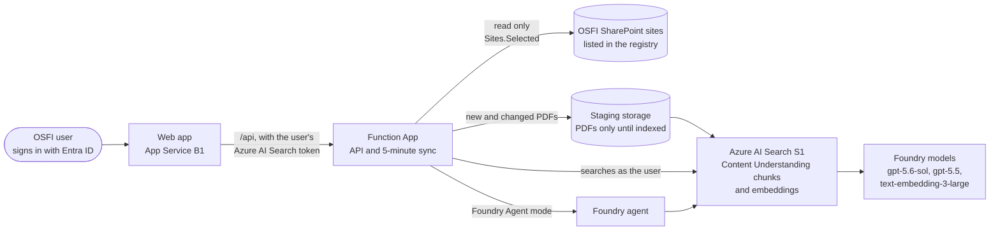
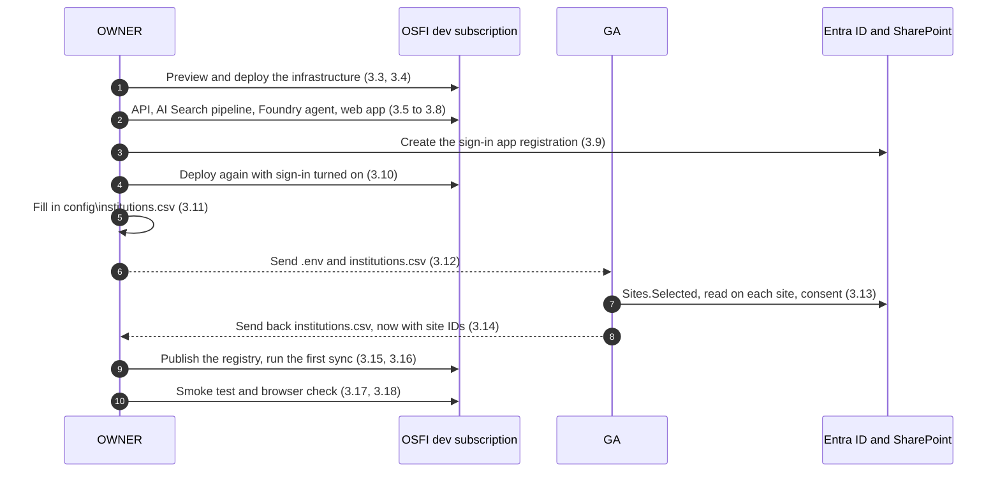

# Deployment runbook: OSFI dev subscription

This runbook deploys the annual-report research solution (citation-grounded questions and answers over PDFs stored in SharePoint) into **OSFI's dev Azure subscription**. Two people from OSFI run it during a deployment call, each on their own Windows machine. Everything is deployed by hand with the Azure CLI, Bicep and the PowerShell and Python scripts in this repository. No GitHub account and no pipeline are needed.

The solution indexes PDFs from **SharePoint sites that OSFI already has**. Nothing is uploaded to those sites and their permissions are not changed: the app gets read-only access to the sites you list, and each person who signs in sees only the sites that their Entra ID groups give them.

Every step below says **who** runs it, **what it does and why**, the **exact commands**, what each **parameter** means, what you **should see**, and what to do **if it fails**.

> [!NOTE]
> This runbook was rehearsed end to end on 8 October 2026, from a fresh clone into an empty resource group, by an Azure Owner and a Global Administrator, against existing SharePoint sites. The times quoted come from that rehearsal.

**Contents**

1. [Overview](#1-overview): people, what gets deployed, how it works, the plan for the call
2. [Before the call](#2-before-the-call): decisions, the site worksheet, access, tools, code, pre-flight checks
3. [During the call](#3-during-the-call): steps 3.1 to 3.18
4. [After the call](#4-after-the-call): giving people access, day-to-day changes, monitoring, cost, teardown, before production
5. [Troubleshooting](#5-troubleshooting)
6. Appendices: [A. Script parameters](#appendix-a-script-parameters) · [B. Files the deployment writes](#appendix-b-files-the-deployment-writes) · [C. Commands by person](#appendix-c-commands-by-person)

**Conventions**

- **OWNER** and **GA** label the two people (see [1.1](#11-people-and-roles)). Every step starts with a line saying who runs it.
- Run every command in **PowerShell 7** (`pwsh`), not in Windows PowerShell 5.1, from the repository folder `C:\work\osfi-rag-deploy` unless the step says otherwise.
- Replace anything in `<angle brackets>` with your value, without the brackets.
- In command blocks, text after `#` is a comment; you don't need to type it.

## 1. Overview

### 1.1 People and roles

| Label | Who | Access needed | Runs |
|---|---|---|---|
| **OWNER** | An OSFI Azure engineer | **Owner** of the dev subscription, the right to **register applications** in Entra ID, and **membership of at least one** of the access groups in the site worksheet ([2.3](#23-access-checklist)) | Every step except 3.13 |
| **GA** | An OSFI tenant administrator | **Global Administrator** in Entra ID, active during step 3.13 (activate it in Privileged Identity Management first if your tenant uses PIM) | Their own tool setup ([2.6](#26-install-the-tools-ga)) and step 3.13 |
| Facilitator | Microsoft | None in OSFI's tenant | Nothing; guides the call and helps with troubleshooting |

If one person holds both roles, they work on one machine, do the steps of both people, and skip the two hand-offs (3.12 and 3.14).

### 1.2 What gets deployed

**Azure resources**, all in one new resource group, `rg-osfi-rag-poc`, in Canada Central except the web app:

| Resource | Name | Purpose |
|---|---|---|
| Azure AI Search, **S1** | `srch-osfi-rag-poc-<token>` | The chunk index (filtered per user), the staging index, the indexer and the two knowledge bases |
| Microsoft Foundry resource and project | `aif-osfi-rag-poc-<token>`, `proj-osfi-rag-poc` | Model deployments `gpt-5-6-sol` (answers and the agent), `gpt-5-5` (figure descriptions while indexing) and `text-embedding-3-large`; Content Understanding (PDF layout and chunking); the prompt agent `osfi-annual-reports-agent` |
| Function App, Flex Consumption, Python 3.12 | `func-osfi-rag-poc-<token>`, identity `id-func-osfi-rag-poc-<token>` | The API and the SharePoint sync, which runs every 5 minutes |
| Storage accounts | `stosfiragpoc<token>`, `stage<token>` | The Function App's own storage, and the staging area that holds each PDF only until it's indexed |
| App Service plan B1 and web app, **Canada East** | `app-osfi-rag-poc-<token>`, identity `id-web-osfi-rag-poc-<token>` | The web UI, with Microsoft Entra ID sign-in |
| Log Analytics and Application Insights | `log-…`, `appi-…` | Logs, telemetry and traces of agent runs |
| Role assignments | | Let the managed identities, and the OWNER, use the services above. No keys are used anywhere except the API's function key. |

`<token>` is a 13-character string derived from the subscription ID, so the names are unique and the same every time you deploy to that subscription.

**Microsoft Entra ID and SharePoint changes:**

| Change | Made by | Step |
|---|---|---|
| App registration and enterprise application `osfi-rag-poc-web`, used by the web app to sign users in. It has no client secret: a federated credential trusts the web app's managed identity instead. Delegated permissions: `openid`, `profile`, `email`, `offline_access`, `User.Read` (Microsoft Graph) and `user_impersonation` (Azure AI Search). | OWNER | 3.9 |
| Tenant-wide admin consent for those delegated permissions, so users aren't asked to consent | GA | 3.13 |
| Microsoft Graph application permission `Sites.Selected` for the Function App's managed identity. On its own this grants access to no site. | GA | 3.13 |
| `read` permission for that identity on each site in the registry, and on no other site | GA | 3.13 |

Nothing is uploaded to SharePoint, and no SharePoint group or site permission is changed apart from the app's `read` grant on the listed sites.

### 1.3 How it works



1. Every 5 minutes the sync reads the **site registry** (`config\institutions.csv`, published in step 3.15), lists each registered site's document libraries through Microsoft Graph, and copies new and changed PDFs into the staging storage.
2. Azure AI Search indexes them: Content Understanding splits each PDF into chunks and records the page each chunk comes from, and the embedding model vectorizes them. The sync then publishes the chunks to the search index, tagged with the **Entra group IDs** listed for that site in the registry, and deletes the staged copy.
3. A user signs in to the web app. Every search runs with **that user's** token, so Azure AI Search returns only chunks whose groups include one of the user's groups. Answers, citations, the PDFs and the library are all filtered this way.
4. Answers come from one of two modes the user can switch between: **Direct retrieval** (a knowledge base plans the search and writes the answer) or **Foundry Agent** (an agent searches the knowledge base through a tool and writes the answer). The API checks every citation before returning an answer.

[README.md](../README.md) describes the architecture in detail.

### 1.4 Plan for the call

| Phase | Steps | Who | Rehearsal time |
|---|---|---|---|
| Before the call: decisions, site worksheet, tools, code, pre-flight checks | [2.1 to 2.8](#2-before-the-call) | OWNER and GA | 30–60 min each; do it a day or more before |
| Start, review the parameters, preview | 3.1 to 3.3 | OWNER | 5 min |
| Deploy the infrastructure | 3.4 | OWNER | 10 min |
| API, AI Search pipeline, agent, web app | 3.5 to 3.8 | OWNER | 6–7 min |
| Sign-in | 3.9 and 3.10 | OWNER | 5 min |
| Site registry and hand-off | 3.11 and 3.12 | OWNER | 5 min |
| SharePoint access and consent | 3.13 | GA | 2–5 min |
| Hand-back, publish, first sync | 3.14 to 3.16 | OWNER | 10 min for 3 reports; longer for more PDFs |
| Smoke test and browser check | 3.17 and 3.18 | OWNER, then GA | 10 min |

Allow about 1 hour 15 minutes for the call. While the infrastructure deploys (3.4), the GA can finish their own setup if it isn't done.



## 2. Before the call

Do this section a day or more before the call. Most of it can't be fixed quickly during the call if it's missing: approvals, roles, quota, installed tools and network access.

### 2.1 Decisions and approvals

**Who:** OWNER, with OSFI's security and cloud governance teams.

Confirm these before the call:

| Topic | What this deployment does | What to confirm |
|---|---|---|
| Data residency | Resources and stored data (index, staging files, logs) are in Canada Central and Canada East. The three model deployments use the **Global Standard** type, the only type these models offer in Canada Central, which may process prompts in any Azure region. | That Global Standard processing is acceptable for the dev subscription and the documents you'll index. |
| Networking | Public endpoints secured with Microsoft Entra ID. Storage and Foundry have key-based access turned off; only the API uses a key (the function key, held in the web app's settings). There are no private endpoints. | That this is acceptable for dev. Private networking needs template changes ([4.9](#49-before-production)). |
| Azure Policy | The templates create the resources listed in [1.2](#12-what-gets-deployed) with the tags `project`, `environment` and `SecurityControl`. | That no policy denies or modifies them: in particular *public network access* (Storage, AI Search, Azure AI services, App Service), *allowed locations* (Canada Central and Canada East are used), *allowed SKUs* (AI Search S1, App Service B1, Flex Consumption) and *required tags*. If one does, arrange an exemption for the resource group `rg-osfi-rag-poc` before the call. Step [2.8](#28-pre-flight-checks-owner) lists the assignments. |
| Cost | About US$250 a month for AI Search S1 and US$13 for App Service B1, whether used or not. The models, Content Understanding (billed per page indexed) and the Function App are pay-per-use. | A budget owner. [4.7](#47-cost) explains how to stop the costs. |
| Which sites | The sync indexes every PDF (up to 128 MB each) in the document libraries of the sites you register. | The sites, their access groups, and that their content may be processed as above. See [2.2](#22-site-worksheet). |

### 2.2 Site worksheet

**Who:** GA (or the SharePoint administrator), with the business owner of the documents. **Hand the finished worksheet to the OWNER before the call.**

**What and why.** The app needs to know which SharePoint sites to read and **which Entra ID groups may see each site's documents**. The OWNER types this into the site registry, `config\institutions.csv`, in step 3.11. The app does not read SharePoint permissions: it shows a site's documents only to the **members** of the groups you list for it here.

Fill in one row per site:

| Column | What to enter | Example |
|---|---|---|
| `institution_key` | A unique ID for the row: lowercase letters, digits and hyphens, up to 63 characters. For several sites of one institution use `rbc-001`, `rbc-002`, and so on. | `rbc` |
| `institution_name` | The name shown in answers and citations. Use the same name on every row of an institution. | `RBC` |
| `site_url` | The site's address, as in the browser's address bar on the site's home page, without anything after the site name. | `https://contoso.sharepoint.com/sites/rbc-annual-reports` |
| `site_id` | **Leave empty.** The GA's script fills it in. | |
| `group_ids` | The **Object ID** of each Entra ID group whose members may see this site's documents. Separate several with `;`. | `11111111-2222-3333-4444-555555555555` |
| `libraries` | Leave empty to read every document library on the site, or list library names separated by `;`. The default library is called `Documents`. | (empty) |
| `language` | `en` or `fr` | `en` |

Finding the group for a site:

- **A Microsoft Teams or Microsoft 365 group site:** the group is the site's access group. Find it in the [Entra admin center](https://entra.microsoft.com) → **Groups** → **All groups**: search for the site's name and copy the group's **Object ID**. The SharePoint admin center (**Sites** → **Active sites** → the site → **Membership**) shows which group a site belongs to.
- **Any other site** (a communication site, or a site shared with SharePoint groups or with individual people): create or choose an Entra security group containing the people who should see the site's documents in the app, and use its Object ID.
- Only **members** of a group count. A group owner who isn't also a member sees nothing in the app.
- Nested groups weren't part of the rehearsal; use groups with direct members for the dev deployment.

Choosing sites for dev:

- Start small: a few sites with tens of PDFs. Indexing takes about 4 to 5 minutes for a 250-page report, and Content Understanding is billed per page.
- Only PDFs are indexed. Other files are ignored, and PDFs over 128 MB are reported as failed.
- The smoke test (3.17) asks about bank capital ratios (CET1). If your sites hold bank annual reports it will find them; otherwise prepare one question your documents answer, for step 3.17.
- Make sure the **OWNER is a member** of at least one of the groups, so they can test the answers.

### 2.3 Access checklist

**OWNER:**

- [ ] **Owner** of the dev subscription. Contributor plus User Access Administrator (or plus Role Based Access Control Administrator) also works. Needed because the templates create role assignments.
- [ ] Can **register applications** in Entra ID: either the tenant setting *Users can register applications* is **Yes**, or the GA assigns you the **Application Developer** role for the day. Needed for step 3.9. Step 2.8 checks it.
- [ ] **Member** of at least one group in the site worksheet. Needed to test answers in 3.17 and 3.18.
- [ ] Local administrator rights on your machine to install the tools, or the tools already installed by your desktop support team ([2.5](#25-install-the-tools-owner)).

**GA:**

- [ ] **Global Administrator**, active during step 3.13. Privileged Role Administrator together with SharePoint Administrator also works.
- [ ] Local administrator rights to install Git and PowerShell 7, or both already installed.
- [ ] Can install a module from the PowerShell Gallery (`www.powershellgallery.com`).

**Subscription and tenant:**

- [ ] The dev subscription is in the **same Entra ID tenant** as the SharePoint sites.
- [ ] Model quota in Canada Central and an App Service plan allowed in Canada East (step 2.8 checks the models).
- [ ] The approvals in [2.1](#21-decisions-and-approvals).

### 2.4 Machine and network

**Who:** OWNER and GA.

- **Windows 10 (version 1809 or later) or Windows 11, 64-bit**, with `winget` (App Installer). About 3 GB of free disk space for the OWNER; the GA needs much less.
- Work in a folder that **isn't synced by OneDrive**, such as `C:\work`. The web app's dependencies and the Python environment contain many thousands of small files.
- The machine must reach these addresses over HTTPS (port 443). If you use a proxy, allow them; if the proxy inspects TLS, see [Troubleshooting](#5-troubleshooting).

| Address | Used by | For |
|---|---|---|
| `github.com`, `api.github.com` | OWNER, GA | Cloning the repository; the Bicep version lookup |
| `pypi.org`, `files.pythonhosted.org` | OWNER | Python packages |
| `registry.npmjs.org` | OWNER | Web app packages |
| `aka.ms`, `downloads.bicep.azure.com` | OWNER | Installing Bicep |
| `www.powershellgallery.com`, `*.powershellgallery.com` | GA | The Microsoft Graph PowerShell module |
| `login.microsoftonline.com`, `login.microsoft.com`, `graph.microsoft.com` | OWNER, GA | Sign-in and Microsoft Graph |
| `management.azure.com` | OWNER | Deploying and managing Azure resources |
| `*.search.windows.net`, `*.services.ai.azure.com`, `*.cognitiveservices.azure.com` | OWNER | Setting up AI Search and the Foundry agent; the tests |
| `*.blob.core.windows.net` | OWNER | Publishing the site registry; sync status |
| `*.azurewebsites.net`, `*.scm.azurewebsites.net` | OWNER, all users | Deploying and using the API and the web app |
| `openaipublic.blob.core.windows.net` | OWNER | Optional: tokenizer data used by the unit tests |

### 2.5 Install the tools (OWNER)

**Who:** OWNER, on their own machine.

**What and why.** The OWNER's machine builds and deploys everything, so it needs six tools:

| Tool | Version | Used for | Manual installer, if `winget` isn't available |
|---|---|---|---|
| Git for Windows | Any recent version | Getting the code | <https://git-scm.com/download/win> |
| Azure CLI (`az`) | 2.65 or later (rehearsed with 2.91.0) | Signing in to Azure, Bicep deployments, managing resources | <https://aka.ms/installazurecliwindowsx64> |
| PowerShell 7 (`pwsh`) | 7.4 or later. **Windows PowerShell 5.1 doesn't work.** | The `.ps1` scripts | <https://learn.microsoft.com/powershell/scripting/install/installing-powershell-on-windows> |
| Python | 3.12 | The setup and test scripts | <https://www.python.org/downloads/windows/> (the 3.12 "Windows installer (64-bit)") |
| Node.js LTS | 22.12 or later; 24 LTS recommended | Building the web app | <https://nodejs.org/en/download> |
| Azure Functions Core Tools (`func`) | 4.x | Publishing the API | <https://go.microsoft.com/fwlink/?linkid=2174087> |

**Run** (in Windows Terminal or PowerShell; approve each administrator prompt):

```powershell
winget install --exact --id Git.Git --source winget --accept-package-agreements --accept-source-agreements
winget install --exact --id Microsoft.AzureCLI --source winget --accept-package-agreements --accept-source-agreements
winget install --exact --id Microsoft.PowerShell --source winget --accept-package-agreements --accept-source-agreements
winget install --exact --id Python.Python.3.12 --source winget --accept-package-agreements --accept-source-agreements
winget install --exact --id OpenJS.NodeJS.LTS --source winget --accept-package-agreements --accept-source-agreements
winget install --exact --id Microsoft.Azure.FunctionsCoreTools --source winget --accept-package-agreements --accept-source-agreements
```

**Parameters:**

- `--exact --id <package>`: install exactly this package, not a similarly named one.
- `--source winget`: use the winget community repository rather than the Microsoft Store.
- `--accept-package-agreements --accept-source-agreements`: accept the license prompts up front, so the installs don't stop to ask.

Then **close every terminal window** so that the new programs are on your `PATH`, and open **PowerShell 7**: Start menu → *PowerShell 7 (x64)*, or Windows Terminal → the drop-down arrow → *PowerShell*. Check the versions:

```powershell
$PSVersionTable.PSVersion.ToString()   # 7.4 or later
git --version                          # git version 2.x
az version                             # "azure-cli": "2.65.0" or later
py -3.12 --version                     # Python 3.12.x
node --version                         # v22.12 or later; v24.x expected
func --version                         # 4.x
```

Finish the setup:

```powershell
az bicep install      # downloads the Bicep compiler that the Azure CLI uses to deploy the templates
az bicep version      # Bicep CLI version 0.4x or later
```

**If it fails:**

- `winget` isn't recognized: use the manual installers in the table above.
- No administrator rights: ask your desktop support team to install the six tools. Per-user alternatives exist (the Python installer has a per-user option, and Core Tools can be installed without administrator rights with `npm install -g azure-functions-core-tools@4 --unsafe-perm true`), but the Azure CLI and PowerShell 7 installers normally need administrator rights.
- `py` isn't recognized: use the full path of Python instead, `& "$env:LOCALAPPDATA\Programs\Python\Python312\python.exe"`, wherever this runbook says `py -3.12`.

### 2.6 Install the tools (GA)

**Who:** GA, on their own machine.

**What and why.** The GA runs one PowerShell script that calls Microsoft Graph. It needs only Git (to get the code), PowerShell 7 and the Microsoft Graph authentication module. It doesn't need the Azure CLI, Python, Node.js or Core Tools.

**Run** (in Windows Terminal or PowerShell; approve each administrator prompt):

```powershell
winget install --exact --id Git.Git --source winget --accept-package-agreements --accept-source-agreements
winget install --exact --id Microsoft.PowerShell --source winget --accept-package-agreements --accept-source-agreements
```

Close the terminal, open **PowerShell 7**, and install the module:

```powershell
Install-Module Microsoft.Graph.Authentication -Scope CurrentUser -Repository PSGallery -Force
Get-Module -ListAvailable Microsoft.Graph.Authentication | Select-Object Name, Version   # 2.x
```

**Parameters:**

- `-Scope CurrentUser`: installs for your account only; no administrator rights needed.
- `-Repository PSGallery`: from the PowerShell Gallery.
- `-Force`: doesn't stop to ask whether to trust the gallery, and installs the NuGet provider if it's missing.

The script in step 3.13 installs this module itself if it's missing; installing it now finds any proxy or policy problem before the call.

### 2.7 Get the code

**Who:** OWNER and GA, each on their own machine, in PowerShell 7.

**What and why.** Downloads this repository: the Bicep templates, the scripts, the API and the web app. The repository is public, so no GitHub account is needed.

**Run:**

```powershell
New-Item -ItemType Directory -Force -Path C:\work | Out-Null
Set-Location C:\work
git clone https://github.com/SenWangMSFT/osfi-rag-deploy.git
Set-Location C:\work\osfi-rag-deploy
git log -1 --format="%h %s"      # the commit you have; OWNER and GA should see the same one
```

**You should see:** `Cloning into 'osfi-rag-deploy'...` and then `done`, within seconds.

**From now on, every command runs in PowerShell 7 in `C:\work\osfi-rag-deploy`.** To check that PowerShell may run the repository's scripts:

```powershell
Get-ExecutionPolicy      # RemoteSigned, Unrestricted or Bypass are fine
```

If it shows `Restricted` or `AllSigned`, run `Set-ExecutionPolicy -Scope Process -ExecutionPolicy Bypass` in each new PowerShell window before running a script. It affects only that window. If even that is refused because a Group Policy sets the policy, ask your desktop support team.

**If it fails:** `Could not resolve host` or a connection error means the machine can't reach GitHub: check the proxy and the network access in [2.4](#24-machine-and-network). If `C:\work\osfi-rag-deploy` already exists from an earlier attempt, delete it or clone into another folder.

### 2.8 Pre-flight checks (OWNER)

**Who:** OWNER, in PowerShell 7 in `C:\work\osfi-rag-deploy`. **Do this a day or more before the call**, so that there's time to fix what it finds.

**1. Sign in to Azure.** Opens a browser window to sign in with your OSFI account (with multi-factor authentication if your tenant requires it), then selects the dev subscription for every later command.

```powershell
az login --tenant <OSFI tenant ID>
az account set --subscription "<OSFI dev subscription ID or name>"
az account show --query "{subscription:name, subscriptionId:id, tenant:tenantId, user:user.name}" -o table
```

- `--tenant`: OSFI's Entra ID tenant ID (Azure portal → **Microsoft Entra ID** → **Overview** → **Tenant ID**), or its primary domain.
- `--subscription`: the dev subscription's ID or name (Azure portal → **Subscriptions**).
- If `az login` lists your subscriptions and asks you to choose one, type the dev subscription's number.
- `az account show` must show the dev subscription, OSFI's tenant and your account.

**2. Check your role.** Lists your management roles on the subscription, including inherited ones:

```powershell
$me = az ad signed-in-user show --query id -o tsv
az role assignment list --assignee $me --all --include-inherited -o json | ConvertFrom-Json |
    Where-Object roleDefinitionName -in 'Owner', 'Contributor', 'User Access Administrator', 'Role Based Access Control Administrator' |
    Select-Object roleDefinitionName, scope | Format-Table -AutoSize
```

You should see **Owner** at the subscription, or at a management group above it (a `scope` starting with `/providers/Microsoft.Management/managementGroups/`), or both Contributor and User Access Administrator.

**3. Register the resource providers.** A new subscription may not be allowed to create these resource types yet. Registering them is safe to repeat, and can take a few minutes:

```powershell
$providers = 'Microsoft.CognitiveServices', 'Microsoft.Search', 'Microsoft.Web', 'Microsoft.Storage',
             'Microsoft.OperationalInsights', 'Microsoft.Insights', 'Microsoft.ManagedIdentity'
foreach ($ns in $providers) {
    az provider register --namespace $ns --wait
    '{0,-32} {1}' -f $ns, (az provider show --namespace $ns --query registrationState -o tsv)
}
```

Each line must end with `Registered`. (`--wait` waits until the registration is finished.)

**4. Check that the models are available.** The deployment needs these three models, in these versions, as Global Standard deployments in Canada Central:

```powershell
$models = az cognitiveservices model list --location canadacentral -o json | ConvertFrom-Json
$models | Where-Object { $_.model.name -in 'gpt-5.6-sol', 'gpt-5.5', 'text-embedding-3-large' } |
    Select-Object @{n = 'Model'; e = { $_.model.name } }, @{n = 'Version'; e = { $_.model.version } },
                  @{n = 'GlobalStandard'; e = { 'GlobalStandard' -in $_.model.skus.name } } |
    Sort-Object Model, Version -Unique | Format-Table -AutoSize
```

You should see these rows (other versions may be listed too):

```
Model                  Version    GlobalStandard
-----                  -------    --------------
gpt-5.5                2026-04-24           True
gpt-5.6-sol            2026-07-09           True
text-embedding-3-large 1                    True
```

**5. Check the model quota.** Shows how many thousand tokens per minute (TPM) the subscription may deploy for each model in Canada Central, and how many are already in use:

```powershell
$usage = az cognitiveservices usage list --location canadacentral -o json | ConvertFrom-Json
$usage | Where-Object { $_.name.value -in 'OpenAI.GlobalStandard.gpt-5.6-sol', 'OpenAI.GlobalStandard.gpt-5.5',
                                         'OpenAI.GlobalStandard.text-embedding-3-large' } |
    Select-Object @{n = 'Quota'; e = { $_.name.value } }, @{n = 'Used'; e = { $_.currentValue } }, @{n = 'Limit'; e = { $_.limit } } |
    Format-Table -AutoSize
```

`Limit` minus `Used` must be at least **250** for `gpt-5.6-sol`, **150** for `gpt-5.5` and **350** for `text-embedding-3-large`. If it isn't, either request more quota on the **Quota** page of the Foundry portal (<https://ai.azure.com>), or lower the `capacity` values in step 3.2. Lower capacity means the app is throttled sooner when several people use it.

**6. Check that you can register applications:**

```powershell
az rest --method get --url https://graph.microsoft.com/v1.0/policies/authorizationPolicy --query defaultUserRolePermissions.allowedToCreateApps
```

`true` means you can. `false` or an `Authorization_RequestDenied` error means you can't (or can't read the setting): ask the GA to assign you the **Application Developer** role (Entra admin center → **Roles & admins** → **Application Developer** → **Add assignments**) for the day of the call. After the role is assigned, run `az login` again.

**7. Check your group membership.** For each group in the site worksheet that you belong to:

```powershell
$me = az ad signed-in-user show --query id -o tsv
az ad group member check --group <group object ID from the worksheet> --member-id $me --query value -o tsv
```

At least one group must return `true`. An error that the group doesn't exist means the worksheet has a wrong Object ID.

**8. List the Azure Policy assignments** that apply to the subscription, for the review in [2.1](#21-decisions-and-approvals):

```powershell
az policy assignment list --disable-scope-strict-match --query "[].{name:displayName, enforcement:enforcementMode}" -o table
```

`--disable-scope-strict-match` includes the assignments inherited from management groups. The preview in step 3.3 also fails early with `RequestDisallowedByPolicy` if a policy denies a resource. If an exemption must be scoped to the resource group, the OWNER can create the group before the call with `az group create --name rg-osfi-rag-poc --location canadacentral`; the deployment then uses it.

**9. Create the Python environment and run the unit tests.** Creates an isolated Python environment in `.venv` with the packages the scripts need, and runs the API's unit tests, which make no Azure calls:

```powershell
py -3.12 -m venv .venv
.\.venv\Scripts\python.exe -m pip install --upgrade pip
.\.venv\Scripts\python.exe -m pip install -r requirements-dev.txt
.\.venv\Scripts\python.exe -m pytest tests -q
```

- `py -3.12 -m venv .venv`: creates the environment with Python 3.12, in the folder `.venv`.
- `pip install -r requirements-dev.txt`: installs the packages listed in that file (the Azure SDK, `requests`, `tiktoken` and `pytest`).
- `pytest tests -q`: runs the tests quietly. The last line must say `passed` and must not mention `failed`; it shows `85 passed`.

## 3. During the call

Steps 3.1 to 3.12 and 3.14 to 3.17 are run by the **OWNER** in one PowerShell 7 window in `C:\work\osfi-rag-deploy`. Step 3.13 is run by the **GA**, and step 3.18 by both.

> [!IMPORTANT]
> Run the steps in order. Every step is safe to run again if it fails or is interrupted, so after fixing a problem, re-run the step that failed and carry on from there.

### 3.1 Open the deployment session

**Who:** OWNER.

**What and why.** Checks that you're signed in to the right tenant and subscription. Every later Azure command uses this sign-in.

```powershell
Set-Location C:\work\osfi-rag-deploy
az account show --query "{subscription:name, subscriptionId:id, tenant:tenantId, user:user.name}" -o table
```

**You should see** the dev subscription, OSFI's tenant ID and your account. If not, or if you get an error about expired tokens, sign in again as in [2.8](#28-pre-flight-checks-owner), item 1:

```powershell
az login --tenant <OSFI tenant ID>
az account set --subscription "<OSFI dev subscription ID or name>"
```

If you opened a new window and your execution policy needs it ([2.7](#27-get-the-code)), run `Set-ExecutionPolicy -Scope Process -ExecutionPolicy Bypass` now.

### 3.2 Review the deployment parameters

**Who:** OWNER.

**What and why.** [infra/main.bicepparam](../infra/main.bicepparam) holds the settings of the deployment: names, regions, search tier and model capacities. The defaults are what was rehearsed; change them only for the reasons below.

```powershell
notepad infra\main.bicepparam
```

| Parameter | Default | Change it when |
|---|---|---|
| `environmentName` | `'osfi-rag-poc'` | OSFI's naming standard requires another prefix. It names every resource and the resource group (`rg-<environmentName>`). 3 to 20 characters: lowercase letters, digits and hyphens. |
| `location` | `'canadacentral'` | Don't change it: the models, Content Understanding and Flex Consumption are all available there. |
| `webAppLocation` | `'canadaeast'` | You'd rather keep the web app in Canada Central too, and the subscription has App Service quota there: set `'canadacentral'`. The rehearsal used Canada East. |
| `searchSku` | `'standard'` (S1) | Don't change it. The web app's unit tests check this value, and Basic can't index PDFs over 16 MB. |
| `chatModel`, `extractionModel`, `embeddingModel` | `capacity` 250, 150 and 350 | Change only `capacity` (thousands of tokens per minute), and only if the quota check in [2.8](#28-pre-flight-checks-owner) showed too little. Keep `name`, `model`, `version` and `sku`: the scripts and tests rely on them. |
| `principalId`, `ciPrincipalId`, `functionAppKey`, `webAuthClientId` | Read from environment variables | Never edit these. The scripts set them. |

The two storage accounts carry a tag `SecurityControl=Ignore`, which exempts them from a policy in Microsoft's test tenant. In OSFI's tenant it does nothing. If OSFI's tagging policy objects to it, remove that tag from [infra/modules/storage.bicep](../infra/modules/storage.bicep) and [infra/modules/staging.bicep](../infra/modules/staging.bicep).

Save and close Notepad.

### 3.3 Preview the infrastructure

**Who:** OWNER. **Takes:** under a minute. **Changes Azure:** no.

**What and why.** Asks Azure Resource Manager what the deployment *would* create or change ("what-if"), without changing anything. It also checks the templates against Azure Policy and your permissions, so problems show up now rather than halfway through the deployment.

```powershell
.\scripts\deploy.ps1 -WhatIfOnly
```

**Parameters:**

- `-WhatIfOnly`: preview only; nothing is created.
- The script has two more parameters that you should leave at their defaults: `-DeploymentName` (`osfi-rag-poc`, the name of the deployment record in the subscription's **Deployments** page) and `-Location` (`canadacentral`, where that record is kept).

**You should see:**

```
Subscription: <dev subscription name> (<subscription ID>)  Tenant: <OSFI tenant ID>
No Function App yet; the web app gets its key from scripts/deploy_web.ps1.

== what-if ==
...
Scope: /subscriptions/<subscription ID>

  + resourceGroups/rg-osfi-rag-poc

Scope: /subscriptions/<subscription ID>/resourceGroups/rg-osfi-rag-poc

  + Microsoft.CognitiveServices/accounts/aif-osfi-rag-poc-<token>
  ...
Resource changes: 37 to create, 11 unsupported.
```

Check that:

- the first line shows the **dev subscription** and **OSFI's tenant**;
- everything is created (`+`) in `rg-osfi-rag-poc`, and nothing is deleted (`-`).

The **11 "unsupported"** items, with a long message that they "cannot be analyzed because its resource ID or API version cannot be calculated until the deployment is under way", are role assignments for identities that don't exist yet. That's expected.

**If it fails:**

- `RequestDisallowedByPolicy`: an Azure Policy denies one of the resources; the message names the policy. Get an exemption (see [2.1](#21-decisions-and-approvals)), then re-run.
- `Bicep CLI not found` or a download error: run `az bicep install` (and check the network access in [2.4](#24-machine-and-network)).
- `TokenCreatedWithOutdatedPolicies` at `az ad signed-in-user show`: run `az login` again.

### 3.4 Deploy the infrastructure

**Who:** OWNER. **Takes:** about 10 minutes (9 min 36 s in the rehearsal). **Changes Azure:** yes.

**What and why.** Creates the resource group and every resource in [1.2](#12-what-gets-deployed) from the Bicep templates in [infra/](../infra/), with all their role assignments. It also gives **your** account the data-plane roles that the next steps need (on AI Search, Foundry and the two storage accounts), and writes the names and endpoints of the new resources to two local files used by every later step.

```powershell
.\scripts\deploy.ps1
```

The script:

1. prints the subscription and tenant;
2. looks up your Entra ID object ID, and passes it to Bicep as `principalId` so that you get the data-plane roles;
3. runs the what-if again, then `az deployment sub create`: a deployment at subscription scope, named `osfi-rag-poc`, because it also creates the resource group;
4. writes the deployment's outputs to `.env` (repository root) and `src\function_app\local.settings.json`. They contain names, endpoints and IDs only, no keys, and Git ignores them.

**You should see,** after the what-if output and about 10 minutes of `== deploying (10-15 minutes) ==`:

```
Wrote C:\work\osfi-rag-deploy\.env
Wrote C:\work\osfi-rag-deploy\src/function_app/local.settings.json

Resource group: https://portal.azure.com/#@<tenant>/resource/subscriptions/<subscription>/resourceGroups/rg-osfi-rag-poc/overview
```

Check the result:

```powershell
Get-Content .env | Select-String '^(AZURE_RESOURCE_GROUP|SEARCH_SERVICE_NAME|FUNCTION_APP_NAME|WEB_APP_NAME|WEB_APP_URL)='
az resource list --resource-group rg-osfi-rag-poc --query "[].{name:name, type:type, location:location}" -o table
```

The first command shows five lines with values; the second lists 13 resources.

**If it fails:** read the error, fix the cause, and run `.\scripts\deploy.ps1` again. The deployment is incremental, so it keeps what was already created. Common causes:

- **Quota** for a model or for App Service (`InsufficientQuota`, `SubscriptionIsOverQuotaForSku`): lower the model `capacity`, or change `webAppLocation`, in step 3.2.
- A **soft-deleted Foundry resource** with the same name, from an earlier attempt that was deleted: purge it with `az cognitiveservices account purge --name <aif-… name> --resource-group rg-osfi-rag-poc --location canadacentral`.
- A **policy** that wasn't caught by the preview, such as one that modifies settings: get an exemption.

### 3.5 Deploy the API

**Who:** OWNER. **Takes:** about 2.5 minutes. **Changes Azure:** yes.

**What and why.** Publishes the API and the SharePoint sync ([src/function_app/](../src/function_app/)) to the Function App with Azure Functions Core Tools. Azure installs the Python packages during the publish (a "remote build"). The sync timer starts running every 5 minutes but does nothing until a site registry is published in step 3.15.

```powershell
.\scripts\deploy_function.ps1
```

The script runs `func azure functionapp publish <FUNCTION_APP_NAME> --python` in `src\function_app`. It has no parameters.

**You should see,** at the end:

```
The deployment was successful!
Functions in func-osfi-rag-poc-<token>:
    ask - [httpTrigger]
        Invoke url: https://func-osfi-rag-poc-<token>.azurewebsites.net/api/ask
    citation_preview - [httpTrigger]
    list_documents - [httpTrigger]
    open_document - [httpTrigger]
    sharepoint_sync - [timerTrigger]
```

**If it fails:** `func` isn't recognized: Core Tools isn't installed, or the window was opened before it was installed; open a new PowerShell 7 window. A sign-in error: run `az login` again. Otherwise re-run the step.

### 3.6 Create the AI Search pipeline

**Who:** OWNER. **Takes:** about 10 seconds; up to 10 minutes if new role assignments are still taking effect. **Changes Azure:** yes.

**What and why.** Creates the search objects from the JSON definitions in [search/](../search/), filling in names from `.env`:

- the Content Understanding defaults on the Foundry resource;
- the data source (the staging container), the chunk index, the staging index and the skillset (Content Understanding chunking, figure descriptions with `gpt-5-5`, embeddings);
- the knowledge source and the two knowledge bases (`annual-reports-kb` for Direct retrieval, `annual-reports-agent-kb` for the agent);
- the indexer, last.

```powershell
.\.venv\Scripts\python.exe scripts\setup_search.py
```

**You should see:**

```
Content Understanding model defaults
  Content Understanding defaults set
PUT datasources/annual-reports-blob
PUT indexes/annual-reports-chunks
PUT indexes/annual-reports-staging
PUT skillsets/annual-reports-skillset
PUT knowledgesources/annual-reports-ks
PUT knowledgebases/annual-reports-kb
PUT knowledgebases/annual-reports-agent-kb
PUT indexers/annual-reports-indexer

Done. The SharePoint sync stages files and starts the indexer; check progress with: python scripts/sync.py
```

Lines like `PUT https://srch-osfi-rag-poc-<token>.search.windows.net/indexes/annual-reports-chunks -> 403; retrying in 5s` are normal right after the deployment: your new roles take a few minutes to apply, and the script keeps retrying for up to 10 minutes.

The script also has `--skip-indexer` and `--recreate-index` options; don't use them here.

### 3.7 Create the Foundry agent

**Who:** OWNER. **Takes:** under 10 seconds. **Changes Azure:** yes.

**What and why.** Creates the prompt agent `osfi-annual-reports-agent` in the Foundry project for the **Foundry Agent** answer mode. The definition comes from [agent/agent.json](../agent/agent.json), with its instructions from [agent/instructions.md](../agent/instructions.md): it uses `gpt-5-6-sol`, and searches the agent knowledge base through an MCP tool, as the signed-in user.

```powershell
.\.venv\Scripts\python.exe scripts\setup_agent.py
```

**You should see:**

```
Agent osfi-annual-reports-agent: created version 1
Playground: https://ai.azure.com/nextgen/r/...
```

Running it again prints `Agent osfi-annual-reports-agent is up to date (version 1)`. So can a new deployment that reuses the names of an earlier, deleted one ([4.6](#46-running-it-again-from-scratch)): Foundry keeps that agent, and the script has checked that its definition matches. `--show` prints the agent's current definition without changing it.

### 3.8 Deploy the web app

**Who:** OWNER. **Takes:** about 3 to 4 minutes. **Changes Azure:** yes.

**What and why.** Builds the web UI ([web/](../web/)) and deploys it, with its small Node.js server, to the App Service web app:

1. `npm ci` installs the exact package versions in `web\package-lock.json` (about 210 packages);
2. `npm test` runs the web unit tests, and `npm run build` type-checks the code and builds the production files;
3. the server and the build are zipped and deployed with `az webapp deploy`, signed in with Entra ID (password-based publishing is turned off);
4. on a first deployment, the function key is copied into the web app's `API_KEY` setting, so that its server can call the API. The site restarts once more for this.

```powershell
.\scripts\deploy_web.ps1
```

**You should see:**

```
added 213 packages in …
...
 Test Files  3 passed (3)
      Tests  30 passed (30)
...
✓ built in …
Deploying to app-osfi-rag-poc-<token>...
WARNING: Status: Build successful. Time: 0(s)
WARNING: Status: Starting the site... Time: 15(s)
...
WARNING: Status: Site started successfully. Time: 126(s)
WARNING: Deployment has completed successfully
Setting API_KEY from the Function App (the site restarts once more)...

Web app: https://app-osfi-rag-poc-<token>.azurewebsites.net
```

The yellow `WARNING:` lines are the Azure CLI's progress messages, and the warning that "some chunks are larger than 500 kB" comes from the build. Neither is a problem.

**Parameters:** `-SkipBuild` redeploys the last build without running `npm` again. Not needed here.

**If it fails:** if a deployment attempt fails, the script waits 30 seconds and retries, up to 3 times. If `npm ci` fails with a certificate error, see [Troubleshooting](#5-troubleshooting).

### 3.9 Create the sign-in app registration

**Who:** OWNER. **Takes:** a few seconds. **Changes Entra ID:** yes.

**What and why.** Users sign in to the web app with their OSFI accounts. The web app needs an app registration in Entra ID for that. The script creates or updates `osfi-rag-poc-web` with:

- single-tenant sign-in (OSFI accounts only), with the web app's sign-in callback address `https://app-osfi-rag-poc-<token>.azurewebsites.net/.auth/login/aad/callback`;
- the delegated permissions `openid`, `profile`, `email`, `offline_access` and `User.Read` (Microsoft Graph), and `user_impersonation` (Azure AI Search). The last one lets the app search **as the signed-in user**, which is how each user sees only their sites;
- its enterprise application (service principal);
- a **federated credential** that trusts the web app's managed identity, so there's **no client secret** to create, store or rotate.

```powershell
.\.venv\Scripts\python.exe scripts\setup_web_auth.py
```

**You should see:**

```
created  app registration osfi-rag-poc-web (<client ID>)
created  service principal
created  federated credential for the web app's managed identity

WEB_AUTH_CLIENT_ID=<client ID>
Turn sign-in on: $env:WEB_AUTH_CLIENT_ID = '<client ID>'; ./scripts/deploy.ps1
A tenant admin then grants consent: ./scripts/grant_sharepoint_access.ps1
```

**Copy the client ID** (a GUID) for the next step. Running the script again updates the same registration (`updated` instead of `created`).

**If it fails** with `Authorization_RequestDenied` or `Insufficient privileges to complete the operation`, you can't register applications. The GA assigns you the **Application Developer** role (see [2.8](#28-pre-flight-checks-owner), item 6); then run `az login` again and re-run this step.

### 3.10 Turn on sign-in

**Who:** OWNER. **Takes:** about 3 minutes. **Changes Azure:** yes.

**What and why.** Deploys the infrastructure again, this time with the client ID from step 3.9. This turns on App Service authentication: every page of the web app then requires an OSFI sign-in (only the `/healthz` health check stays open), and the sign-in also gets the user an Azure AI Search token, which the web app's server passes to the API. The restart applies the new settings at once.

```powershell
$env:WEB_AUTH_CLIENT_ID = '<client ID from step 3.9>'
.\scripts\deploy.ps1
. .\scripts\_env.ps1
az webapp restart --resource-group $cfg.AZURE_RESOURCE_GROUP --name $cfg.WEB_APP_NAME
Get-Content .env | Select-String '^WEB_AUTH_CLIENT_ID='
```

- `$env:WEB_AUTH_CLIENT_ID = …` sets an environment variable that `infra\main.bicepparam` reads. You set it only this once: `deploy.ps1` saves the value in `.env` and the deployment's outputs, and later runs carry it over.
- `. .\scripts\_env.ps1` (note the leading dot and space) loads the values of `.env` into a variable `$cfg`, so that the next command can use the resource group and web app names.
- `az webapp restart` restarts the web app.

**You should see** the what-if (`Resource changes: 38 to deploy, 11 unsupported.`), the `Wrote …\.env` lines, and finally `WEB_AUTH_CLIENT_ID=<client ID>`. If that last line shows no value, the variable wasn't set: repeat the step.

Nobody can sign in yet: the GA grants the consent in step 3.13.

### 3.11 Fill in the site registry

**Who:** OWNER, using the site worksheet from [2.2](#22-site-worksheet). **Changes Azure:** no.

**What and why.** [config/institutions.csv](../config/institutions.csv) is the **site registry**: which SharePoint sites to read, and which Entra ID groups may see each site's documents. In this repository it contains only its header line; you add one line per site.

```powershell
notepad config\institutions.csv
```

Keep the header line exactly as below, and add one line per row of the worksheet under it. Leave `site_id` empty. For example (made-up values):

```
institution_key,institution_name,site_url,site_id,group_ids,libraries,language
rbc,RBC,https://contoso.sharepoint.com/sites/rbc-annual-reports,,11111111-2222-3333-4444-555555555555,,en
td,TD,https://contoso.sharepoint.com/sites/td-annual-reports,,22222222-3333-4444-5555-666666666666;33333333-4444-5555-6666-777777777777,Documents,en
```

Save, close Notepad, and validate the file:

```powershell
.\.venv\Scripts\python.exe scripts\onboard_sites.py --check
```

- `--check` only validates the file and prints it; nothing is published.

**You should see** one line per site, such as:

```
rbc                RBC                  1 group(s)  https://contoso.sharepoint.com/sites/rbc-annual-reports  (no site_id yet: run scripts/grant_sharepoint_access.ps1)
td                 TD                   2 group(s)  https://contoso.sharepoint.com/sites/td-annual-reports  (no site_id yet: run scripts/grant_sharepoint_access.ps1)
```

**If it fails,** it lists every problem with its line number, for example:

```
line 2: institution_key 'RBC Bank' must be lowercase letters, digits and hyphens
line 2: group ID 'not-a-guid' isn't an Entra object ID
```

Fix those lines and check again.

Use Notepad or another text editor rather than Excel. If you do use Excel, save as **CSV UTF-8 (Comma delimited)** and keep the header line exactly as shown.

### 3.12 Hand off two files to the GA

**Who:** OWNER sends; GA receives. **Do this only after step 3.10**, so that `.env` contains `WEB_AUTH_CLIENT_ID`.

**What and why.** The GA's script needs to know the tenant, the sync's managed identity and the sign-in app registration (from `.env`), and the sites (from the registry). Neither file contains a key or secret: only names, endpoints and IDs.

OWNER: send these two files to the GA, for example in a Teams chat (zip them if your email or chat blocks the file names):

- `C:\work\osfi-rag-deploy\.env`
- `C:\work\osfi-rag-deploy\config\institutions.csv`

GA: save them into your clone, replacing the existing registry:

- `.env` → `C:\work\osfi-rag-deploy\.env`. The name is exactly `.env`: make sure Windows doesn't save it as `.env.txt`.
- `institutions.csv` → `C:\work\osfi-rag-deploy\config\institutions.csv`.

GA: check them in PowerShell 7:

```powershell
Set-Location C:\work\osfi-rag-deploy
Get-Content .env | Select-String '^(AZURE_TENANT_ID|FUNCTION_PRINCIPAL_ID|WEB_AUTH_CLIENT_ID)='
Import-Csv config\institutions.csv | Format-Table institution_key, site_url, group_ids
```

**You should see** three lines, each with a value, and a table of your sites.

The GA's script uses only those three lines of `.env`. If sending the file is a problem, the OWNER can send just the three lines in a chat message, and the GA creates the file:

```powershell
Set-Content -Path .env -Value 'AZURE_TENANT_ID=<value>', 'FUNCTION_PRINCIPAL_ID=<value>', 'WEB_AUTH_CLIENT_ID=<value>'
```

### 3.13 Grant SharePoint access and consent to sign-in

**Who:** **GA**, on their own machine, in PowerShell 7 in `C:\work\osfi-rag-deploy`. **Takes:** 2 to 5 minutes. **Changes Entra ID and SharePoint:** yes.

**Before you start:**

1. If your tenant uses Privileged Identity Management, **activate Global Administrator** and wait until it shows as active.
2. Be ready to sign in straight away: the sign-in **times out after 2 minutes**.

**What and why.** This is the only step that needs a tenant administrator. The script signs in to Microsoft Graph as you and:

1. gives the Function App's managed identity (`id-func-osfi-rag-poc-<token>`) the Microsoft Graph **application permission `Sites.Selected`**. On its own, this permission grants access to **no** site;
2. for each site in the registry, finds the site from its `site_url`, grants that identity **`read` on that site only**, and writes the site's ID and exact URL back into `config\institutions.csv`;
3. grants **tenant-wide consent** for `osfi-rag-poc-web` (`openid profile email offline_access User.Read` on Microsoft Graph, and `user_impersonation` on Azure AI Search), so that users can sign in without being asked to consent.

It doesn't upload, change or delete anything in the sites.

```powershell
.\scripts\grant_sharepoint_access.ps1
```

A Windows sign-in window opens. Sign in with your Global Administrator account. The first time, Microsoft asks you to approve the permissions that **Microsoft Graph Command Line Tools** (Microsoft's PowerShell module) needs for your session: `AppRoleAssignment.ReadWrite.All`, `Application.Read.All`, `Sites.FullControl.All` and `DelegatedPermissionGrant.ReadWrite.All`. Select **Accept**. Consenting on behalf of your organization isn't necessary.

If no sign-in window appears, or you get `User canceled authentication`, sign in from a browser with a code instead:

```powershell
.\scripts\grant_sharepoint_access.ps1 -UseDeviceCode
```

It prints `To sign in, use a web browser to open the page https://login.microsoft.com/device and enter the code <CODE> to authenticate.` Open that page, enter the code and sign in, **within 2 minutes**. In testing, a **second code** followed straight after the first sign-in: enter it the same way, again within 2 minutes. Keep the browser page open between the two.

**Parameters:**

- `-UseDeviceCode`: sign in with a code in a browser instead of a sign-in window.

**You should see:**

```
Signed in to Microsoft Graph as <your account>

granted  Sites.Selected for id-func-osfi-rag-poc-<token>
granted  read on https://<tenant>.sharepoint.com/sites/<site 1>
granted  read on https://<tenant>.sharepoint.com/sites/<site 2>
Updated C:\work\osfi-rag-deploy\config\institutions.csv with each site's URL and ID.
consent  osfi-rag-poc-web: openid profile email offline_access User.Read
consent  osfi-rag-poc-web: user_impersonation

Next: python scripts/onboard_sites.py (publishes the registry), then python scripts/sync.py --run
```

Then sign out of Microsoft Graph:

```powershell
Disconnect-MgGraph
```

Running the script again is safe: grants that already exist show `ok` instead of `granted`. Re-run it whenever sites are added to the registry.

**If it fails:**

- `Authentication timed out after 120 seconds due to inactivity`: run it again and complete the sign-in sooner. Activate the role **before** starting the script. With `-UseDeviceCode`, watch for the second code, which appears right after the first sign-in.
- `skip     sign-in consent (no WEB_AUTH_CLIENT_ID yet …)`: your `.env` lacks the client ID. Get the current `.env` from the OWNER (after step 3.10) and run the script again.
- `<key>: site not ready yet; retrying in 30 s`, repeated, then `No site for <key>`: the `site_url` is wrong. It must be the site's own address, such as `https://contoso.sharepoint.com/sites/name`, without a library, folder or page after it. The OWNER corrects the registry and sends it again.
- `403` or `Authorization_RequestDenied`: the Global Administrator role isn't active for this sign-in. Activate it, run `Disconnect-MgGraph`, and run the script again.

### 3.14 Hand the registry back to the OWNER

**Who:** GA sends; OWNER receives.

**What and why.** In step 3.13 the script wrote each site's ID into the GA's copy of `config\institutions.csv`. The OWNER publishes that version.

GA: send `C:\work\osfi-rag-deploy\config\institutions.csv` to the OWNER.

OWNER: save it as `C:\work\osfi-rag-deploy\config\institutions.csv` (replace the file), then check it:

```powershell
.\.venv\Scripts\python.exe scripts\onboard_sites.py --check
```

**You should see** your sites without the `(no site_id yet …)` note, now that each row has a `site_id`.

### 3.15 Publish the site registry

**Who:** OWNER. **Takes:** a few seconds. **Changes Azure:** yes.

**What and why.** Validates `config\institutions.csv` and uploads it as `registry.json` to the `sync-state` container of the staging storage account. The sync reads it at the start of every run, so from now on it reads the registered sites.

```powershell
.\.venv\Scripts\python.exe scripts\onboard_sites.py
```

**You should see** your sites, then:

```
Published 3 sites to sync-state/registry.json. The next sync run uses it.
```

If it prints `waiting for the Storage Blob Data Contributor role to apply...`, your role from step 3.4 is still taking effect; it retries for up to 5 minutes.

### 3.16 Run the first sync and watch the indexing

**Who:** OWNER. **Takes:** about 10 minutes for 3 annual reports; longer for more documents. **Changes Azure:** yes.

**What and why.** Starts the sync now instead of waiting for its next 5-minute run, waits until that run has listed the sites' libraries and staged the new PDFs, then shows the status every minute until no file is left waiting. Each PDF goes from `staged` (copied to the staging storage and waiting for the indexer) to `indexed` (with its number of chunks, once published to the search index), or to `failed` (with the reason).

```powershell
.\.venv\Scripts\python.exe scripts\sync.py --run --watch
```

**Parameters:**

- `--run`: start a sync run now in the Function App.
- `--watch`: repeat the status every 60 seconds until nothing is waiting.
- Without parameters, the script shows the status once. It also has `--reset-state` (forget what was synced and index everything again); don't use it here.

**You should see,** first:

```
Sync started in the Function App. Its summary goes to Application Insights (traces: sharepoint_sync).
Waiting for it to list the libraries and stage new files...

rbc (RBC): 1 libraries  https://<tenant>.sharepoint.com/sites/<site>
  library b!GkEN7GNSW0... up to date: 1 staged
    staged   RBC Annual Report 2025.pdf
...
staging container: 3 file(s)
staging index: 0 chunks waiting to be published
chunk index: no chunks
indexer: last run inProgress (0 processed, 0 failed) 2026-10-08T18:12:03.213Z -> None

6 file(s) still waiting; checking again in 60 s...
```

and, at the end:

```
rbc (RBC): 1 libraries  https://<tenant>.sharepoint.com/sites/<site>
  library b!GkEN7GNSW0... up to date: 1 indexed
    indexed  RBC Annual Report 2025.pdf  671 chunks
...
staging container: 0 file(s)
staging index: 0 chunks waiting to be published
chunk index: td 726, rbc 671, bmo 570
indexer: last run success (3 processed, 0 failed) ...
```

How long it takes:

- The indexer takes about 4 to 5 minutes for a 250-page report. In the rehearsal, 3 annual reports (BMO, RBC and TD) were indexed in 7 minutes and were searchable 8.5 minutes after the sync started.
- Each sync run stages at most 25 PDFs, and runs every 5 minutes, so a site with 100 PDFs takes at least 4 runs to stage everything.
- Indexed chunks become searchable at the next sync run after the indexer finishes, within 5 minutes.
- Press **Ctrl+C** to stop watching at any time; the sync and the indexing carry on in Azure. Run `.\.venv\Scripts\python.exe scripts\sync.py` later to see the status.

**If it fails:**

- A site shows `0 libraries` after the run: the sync can't read it. The GA's grant (3.13) is missing for that site, or its `site_url` is wrong. The run's errors are in Application Insights (`traces` starting with `sharepoint_sync`).
- A file shows `failed`: the line gives the reason, for example a damaged PDF or one over 128 MB. Fix the file in SharePoint; the next run picks up the change.
- A file stays `staged` for more than 20 minutes: run `.\.venv\Scripts\python.exe scripts\indexer.py` to see the indexer's status and errors.
- `No sites registered yet`: run step 3.15 first.

### 3.17 Run the smoke test

**Who:** OWNER. **Takes:** under a minute. **Changes Azure:** no.

**What and why.** Calls the deployed API and web app **as you**, with your Azure AI Search token, and checks that everything works end to end, including the permission checks.

```powershell
.\.venv\Scripts\python.exe scripts\smoke_test.py
```

**You should see** every check pass:

```
PASS  documents list as you: HTTP 200, 3 documents your groups can see
PASS  ask requires the function key: HTTP 401
PASS  ask requires a user token: HTTP 401
PASS  /api/documents requires a user token: HTTP 401
PASS  /api/docs/does-not-exist requires a user token: HTTP 401
PASS  /api/citation requires a user token: HTTP 401
PASS  ask validates input: HTTP 400
PASS  ask (direct) returns a gated answer: HTTP 200, 3 citations, 6527 ms
PASS  ask (direct) cites a page: 3 citations
PASS  citation names its SharePoint document: document_id 01BOKHLY...
PASS  cited PDF streams from SharePoint: HTTP 200, 4951812 bytes
PASS  pdf link as JSON: HTTP 200
PASS  citationUrl preview resolves to the cited page: HTTP 200, page 63
PASS  ask (agent) returns a gated answer: HTTP 200, ...
PASS  citation preview refuses foreign URLs: HTTP 400
PASS  unknown document is 404: HTTP 404
PASS  web app sends visitors to sign in: HTTP 401
PASS  web app health endpoint: HTTP 200

18/18 checks passed
```

What the checks cover: you can list the documents your groups can see; every API route refuses calls without the function key or without a user token; a Direct retrieval question returns an answer whose citations are verified; the cited PDF streams from SharePoint and the citation preview finds the cited page; a Foundry Agent question returns a verified answer; the API refuses to fetch URLs outside the search service; and the web app sends anonymous visitors to the sign-in page.

**Read the results:**

- **`documents list as you` must show more than 0 documents.** If it shows 0, your account isn't a member of any group in the registry, or the files aren't indexed yet (3.16). The answer and citation checks are then skipped.
- The answer checks ask about the **CET1 ratio** of a Canadian bank. If your sites don't hold bank annual reports, `ask (direct) cites a page` can fail although everything works. Ask a question that your documents answer instead:

  ```powershell
  .\.venv\Scripts\python.exe scripts\ask.py "<a question your documents answer>"
  .\.venv\Scripts\python.exe scripts\ask.py --mode agent "<the same question>"
  ```

  Each prints the answer, its citations and a summary line, for example:

  ```
  A (direct): BMO reported fiscal 2025 **net income of C$8,725 million** and **diluted EPS of C$11.44**. [1]

    [1] BMO Financial Group 2025 Annual Report — p. 26   (bmo_ar2025.pdf#page=26)

  gate passed | grounded sentences 1.0 (1/1) | 12 references | 5011 ms | HTTP 200 | tokens in 11316 out 116
  ```

  `gate passed` means every citation was verified against the retrieved passages. `--mode agent` uses the Foundry Agent answer mode.
- `ask (agent) returns a gated answer` failed with `HTTP 502` on the rehearsal day because of a platform problem affecting every agent tool; see [Troubleshooting](#5-troubleshooting). Direct retrieval was not affected.

### 3.18 Check the web app in a browser

**Who:** OWNER first, then the GA. **Takes:** 5 to 10 minutes.

**What and why.** Confirms what users will experience: sign-in, answers with citations, the PDF viewer and the library, and that people see only the sites their groups allow.

OWNER:

```powershell
.\scripts\open_ui.ps1
```

This opens the web app's address (`WEB_APP_URL` in `.env`) in your default browser. Then:

1. **Sign in** with your OSFI account. The start page, "Start with a question.", appears. The **Library** button at the top shows the number of documents your groups can see.
2. **Ask a question** that your documents answer, or select a suggested question. Within about 5 to 25 seconds an answer appears, with numbered citation chips, such as `[1]`.
3. **Select a citation chip.** The *Source explorer* opens the PDF at the cited page; the **Passage** tab shows the exact passage used.
4. Open the **Library**. It lists only the documents of the sites your groups can see.
5. Under the question box, switch to **Foundry Agent** and ask a question. The answer is labelled *Foundry Agent* and has citations too.

GA: open the same address (the OWNER can share it) and sign in. If you're not a member of any group in the registry, the Library shows **0** documents and questions find nothing. That's correct: it shows that access follows group membership.

If the web app doesn't ask you to sign in, wait a minute and reload, or restart it as in step 3.10. If a user is asked to consent to permissions, the consent in step 3.13 is missing: the GA runs that step again with an up-to-date `.env`.

**The deployment is complete.** Share the web app's address with the testers, and make sure they're members of the right groups ([4.1](#41-give-people-access)).

## 4. After the call

### 4.1 Give people access

**Who:** whoever manages the groups (GA, group owners or the identity team).

People see a site's documents in the app if they're **members** of one of the groups listed for that site in the registry. To give or remove access, add or remove people as members of those groups, in the [Entra admin center](https://entra.microsoft.com) (**Groups** → the group → **Members**) or in the Microsoft 365 admin center. Nothing needs to be redeployed or re-indexed.

- Changes take a few minutes to reach the app, because Azure AI Search caches group memberships. In testing, an added member saw the documents after about 6 minutes.
- Group owners who aren't members see nothing.
- To change **which groups** grant access to a site, edit `group_ids` in `config\institutions.csv` and publish the registry again (step 3.15). The next sync run updates the permissions on every chunk of that site, without re-indexing.

### 4.2 Optional: limit who can sign in

By default every account in the tenant can sign in, but sees only the sites of its groups. To let only specific people or groups sign in at all: Entra admin center → **Enterprise applications** → `osfi-rag-poc-web` → **Properties** → set **Assignment required?** to **Yes** → **Save**; then **Users and groups** → **Add user/group**.

### 4.3 Remove temporary rights

- If the OWNER was given the **Application Developer** role for the call, remove it.
- The GA deactivates the Global Administrator role in PIM.
- The OWNER keeps the data-plane roles from step 3.4 on the deployed resources (AI Search, Foundry, storage); the scripts in this runbook need them. Search Index Data Contributor lets its holder read **every** indexed chunk, regardless of groups, so keep these roles to operators.

### 4.4 Day-to-day changes

| Change | Who and how |
|---|---|
| Add, replace or delete a document | Anyone with edit rights, in the SharePoint library. The sync picks it up within 5 minutes; a new or changed PDF is searchable about 10 to 15 minutes later. Deleted documents are removed from the index at the next run. |
| Add a site | OWNER adds a row to `config\institutions.csv` (3.11) → GA runs `.\scripts\grant_sharepoint_access.ps1` with the OWNER's `.env` and registry (3.12 to 3.14) → OWNER runs `onboard_sites.py` (3.15). The next sync indexes every PDF on the site. |
| Remove a site | OWNER deletes its row and runs `onboard_sites.py`. The next sync deletes its chunks from the index. The GA can then remove the app's read grant on that site (see [4.8](#48-teardown)). |
| See the sync status | OWNER: `.\.venv\Scripts\python.exe scripts\sync.py` |
| Deploy a newer version of this repository | OWNER: `git pull`, then re-run steps 3.4 to 3.8. Each is safe to re-run; `deploy.ps1` keeps the sign-in settings and the function key. |
| Recreate a lost `.env` (new machine, deleted file) | OWNER: `.\scripts\deploy.ps1 -OutputsOnly`. It reads the outputs of the last deployment and changes nothing in Azure. |

**Configuration changes** (OWNER). The web app's specification pages quote the prompts and settings below, and `deploy_web.ps1` (3.8) runs tests that fail until they match. So update `web\src\lib\specs.ts` in the same change, and `web\src\lib\specs.test.ts` where it pins a value you change, such as a reasoning effort. Run `npm test` in `web\` to see what differs.

| Change | How |
|---|---|
| Direct retrieval's instructions or limits | Edit `retrievalInstructions`, `answerInstructions`, `retrievalReasoningEffort` or `retrieveDefaults` in `search\knowledge-base.json`, then re-run steps 3.6 and 3.8. The change applies from the next question, without re-indexing. The Foundry agent's knowledge base is `search\knowledge-base-agent.json`. |
| The Foundry agent | Edit `agent\instructions.md` (its instructions) or `agent\agent.json` (model deployment, reasoning effort, tool), then re-run steps 3.7 and 3.8. `setup_agent.py` creates a new agent version, which the API uses from the next question. To roll back, restore the previous files and run it again. |
| Index fields or the skillset (for example the chunking) | Edit the files in `search\` and re-run step 3.6. Adding an index field applies directly. Changing or removing one fails with `400`, and skillset changes reach only files indexed afterwards. In both cases run `setup_search.py --recreate-index`, then `sync.py --reset-state --run --watch`. Answers are empty until every file is indexed again, and Content Understanding bills every PDF again. |

**Rotate the function key** (OWNER), the only key the solution uses:

```powershell
. .\scripts\_env.ps1
az functionapp keys set --resource-group $cfg.AZURE_RESOURCE_GROUP --name $cfg.FUNCTION_APP_NAME --key-type functionKeys --key-name default
.\scripts\deploy.ps1
```

`az functionapp keys set` without a value generates a new key, and `deploy.ps1` copies it into the web app's `API_KEY` setting. Until `deploy.ps1` finishes, the web app gets `401` from the API.

### 4.5 Monitoring and logs

The web app and the API send telemetry to Application Insights (`appi-osfi-rag-poc-<token>`). In the Azure portal: the Application Insights resource → **Logs**. For example, the sync's runs:

```kusto
traces
| where timestamp > ago(1d) and message startswith "sharepoint_sync"
| project timestamp, summary = parse_json(substring(message, 16))
| order by timestamp desc
```

Each run's summary lists the files staged, indexed, failed and deleted, the chunks published, and the errors per site. `cloud_RoleName` tells the web app and the API apart. More queries:

```kusto
// Failed requests in the last day, web app and API
requests
| where timestamp > ago(1d) and success == false
| project timestamp, cloud_RoleName, name, resultCode, duration
| order by timestamp desc
```

```kusto
// Exceptions in the last day
exceptions
| where timestamp > ago(1d)
| project timestamp, cloud_RoleName, type, outerMessage
| order by timestamp desc
```

```kusto
// Latency and grounding of every question
traces
| where message startswith "ask_telemetry"
| extend m = parse_json(substring(message, 14))
| project timestamp, mode = tostring(m.mode), elapsed_ms = toint(m.elapsed_ms), gate_passed = tobool(m.gate_passed),
          grounded = todouble(m.grounded_sentence_ratio), citations = toint(m.citation_count)
```

```kusto
// Foundry Agent runs: invoke_agent, execute_tool per knowledge base call, chat per model call
dependencies
| where timestamp > ago(1d) and cloud_RoleName == "responsesapi"
| project timestamp, response_id = tostring(customDimensions["gen_ai.response.id"]), name, duration, success
| order by timestamp desc
```

- **Live:** Application Insights → **Live metrics**.
- **Agent traces:** Foundry portal → **Agents** → `osfi-annual-reports-agent` → **Traces**. Each run shows the conversation, each knowledge base call with its query and passages, the model calls and the answer; search by an answer's response ID, shown under the answer's technical details. Traces appear a few minutes after a run. Viewing them needs Log Analytics Reader on the Application Insights resource, or a broader role such as Contributor. They contain document passages, so limit who has it.
- **Web server console:** web app → **Log stream**. If it shows nothing, turn on **App Service logs** → **Application logging (File System)**.
- **Indexing:** `.\.venv\Scripts\python.exe scripts\sync.py` shows each site, library and file with its status; `scripts\indexer.py` shows the indexer's own status and errors.

### 4.6 Running it again from scratch

To redeploy into an empty subscription or after a teardown, repeat section 3 from step 3.1. Step 3.13 must be repeated too: the new managed identity and the new web app need new grants and a new federated credential.

After a teardown, deploy under a **new `environmentName`** ([3.2](#32-review-the-deployment-parameters)), which gives every resource a new name. A Foundry resource re-created under the name of a deleted one can keep state from it: in testing, Content Understanding then couldn't reach the new model deployment, and every PDF failed in 3.16 (see [Troubleshooting](#5-troubleshooting)).

### 4.7 Cost

| Item | Cost |
|---|---|
| Azure AI Search S1 | About US$250 a month, whether used or not |
| App Service plan B1 (web app) | About US$13 a month |
| Function App (Flex Consumption), models, Content Understanding | Pay per use. Indexing is billed per page, once per document version. |
| Storage, Log Analytics and Application Insights | Small at this scale |

AI Search can't be paused. To stop the costs, delete the deployment (4.8).

### 4.8 Teardown

**Who:** OWNER, then optionally the GA.

**What and why.** Deletes everything this runbook created. The documents in SharePoint are not affected.

OWNER, in PowerShell 7 in `C:\work\osfi-rag-deploy`:

```powershell
. .\scripts\_env.ps1
az identity show --resource-group $cfg.AZURE_RESOURCE_GROUP --name "id-$($cfg.FUNCTION_APP_NAME)" --query clientId -o tsv   # note it for the GA
az group delete --name $cfg.AZURE_RESOURCE_GROUP
az cognitiveservices account purge --name $cfg.FOUNDRY_NAME --resource-group $cfg.AZURE_RESOURCE_GROUP --location canadacentral
az ad app delete --id $cfg.WEB_AUTH_CLIENT_ID
```

- The sync's managed identity is named `id-` followed by the Function App's name. Its client ID is what the SharePoint grants refer to; note it before deleting the resource group.
- `az group delete` asks for confirmation (`y`). It took under 2 minutes in the rehearsal, but can take longer. Deleting the identity also removes its `Sites.Selected` permission.
- `az cognitiveservices account purge` permanently deletes the Foundry resource, which is otherwise kept for 48 hours as "soft-deleted" and blocks reusing its name. It takes about a minute.
- `az ad app delete` deletes the `osfi-rag-poc-web` app registration and, with it, its enterprise application and the tenant-wide consent. Entra ID keeps the deleted registration for 30 days under **App registrations** → **Deleted applications**, where it can be restored or permanently deleted.
- Optionally, `az deployment sub delete --name osfi-rag-poc` removes the deployment record from the subscription's **Deployments** page.

GA, optional: the `read` grants on the sites can't be used once the identity is deleted, but you can remove them. In PowerShell 7 in `C:\work\osfi-rag-deploy`, with the registry that has the site IDs:

```powershell
$appId = '<client ID of the sync identity, noted by the OWNER>'
Connect-MgGraph -TenantId '<OSFI tenant ID>' -Scopes 'Sites.FullControl.All' -NoWelcome
foreach ($row in Import-Csv config\institutions.csv) {
    $grants = (Invoke-MgGraphRequest GET "https://graph.microsoft.com/v1.0/sites/$($row.site_id)/permissions" -OutputType PSObject).value
    foreach ($grant in $grants | Where-Object { @($_.grantedToIdentitiesV2.application.id) + @($_.grantedToIdentities.application.id) -contains $appId }) {
        Invoke-MgGraphRequest DELETE "https://graph.microsoft.com/v1.0/sites/$($row.site_id)/permissions/$($grant.id)"
        "removed  read on $($row.site_url)"
    }
}
Disconnect-MgGraph
```

### 4.9 Before production

This deployment is for dev. Before production, or before registering several hundred sites, plan for the following. Items 1 to 3 need changes to the templates or the code.

1. **Private networking.** The templates use public endpoints secured with Microsoft Entra ID. Production may need private endpoints for AI Search, Storage and Foundry, and network integration for the Function App and the web app.
2. **Parallel sync.** The sync handles the sites one after another and makes about three Microsoft Graph calls per site even when nothing changed. At 1,000 sites a run would take roughly 15 to 20 minutes instead of fitting in its 5-minute cycle. A queue that syncs several sites at once needs to be built.
3. **First-load throughput.** One indexer handles about 140 pages a minute. 1,000 sites with 20 reports of 200 pages each is about 4 million pages: roughly 20 days with one indexer, or 5 days with four indexers working in parallel, which also need to be built. During a large first load, raise the `text-embedding-3-large` capacity in `infra\main.bicepparam` and run `deploy.ps1`; lower it again afterwards.
4. **Capacity.** Per 1,000 PDF pages, the index needs about 85 MB of storage and 39 MB of vectors; one S1 partition holds about 900,000 pages. About 4 million pages need about 5 partitions, a larger tier, or vector compression after testing retrieval quality.
5. **Hardening.** At least 2 search replicas for the query SLA; Search API keys turned off; customer-managed keys if required; restricted access to Application Insights, whose agent traces contain passages; alerts on sync failures; and, if needed, sign-in limited to assigned users ([4.2](#42-optional-limit-who-can-sign-in)).

## 5. Troubleshooting

| Symptom | Step | Cause | Fix |
|---|---|---|---|
| A script fails with odd errors, for example `A parameter cannot be found that matches parameter name 'UseQuotes'` | Any | It ran in Windows PowerShell 5.1 | Open **PowerShell 7** (`pwsh`). `$PSVersionTable.PSVersion` must be 7.4 or later. |
| `… cannot be loaded because running scripts is disabled on this system` or `… is not digitally signed` | Any `.ps1` | Execution policy | `Set-ExecutionPolicy -Scope Process -ExecutionPolicy Bypass` in that window ([2.7](#27-get-the-code)) |
| `py`, `func`, `az` or `node` isn't recognized | Any | The tool isn't installed, or the window was opened before it was installed | Open a new PowerShell 7 window; reinstall the tool ([2.5](#25-install-the-tools-owner)) |
| `SSL: CERTIFICATE_VERIFY_FAILED` (pip, Python scripts, Azure CLI) or `SELF_SIGNED_CERT_IN_CHAIN` (npm) | 2.8, 3.8 | A proxy inspects TLS with its own certificate | Ask your network team for the proxy's root certificate (a `.pem` file), then set, in the same window, `$env:REQUESTS_CA_BUNDLE = '<path to .pem>'` (Python and Azure CLI) and `$env:NODE_EXTRA_CA_CERTS = '<path to .pem>'` (npm). For pip, also `$env:PIP_CERT = '<path to .pem>'`. |
| `AADSTS53003` or another Conditional Access error at sign-in | 2.8, 3.13 | The device or location doesn't meet a Conditional Access policy | Use a compliant OSFI device on the corporate network, or ask the identity team |
| `TokenCreatedWithOutdatedPolicies` at `az ad signed-in-user show` | 3.3, 3.4 | Your Graph token was revoked | `az login --tenant <OSFI tenant ID>` again |
| `RequestDisallowedByPolicy` | 3.3, 3.4 | An Azure Policy denies a resource or setting | Get a policy exemption for `rg-osfi-rag-poc` ([2.1](#21-decisions-and-approvals)) |
| `InsufficientQuota` or `SubscriptionIsOverQuotaForSku` | 3.4 | Not enough model or App Service quota | Lower the model `capacity`, or change `webAppLocation` ([3.2](#32-review-the-deployment-parameters)), or request quota |
| A Foundry resource with the same name is soft-deleted | 3.4 | An earlier attempt was deleted without being purged | `az cognitiveservices account purge --name <aif-… name> --resource-group rg-osfi-rag-poc --location canadacentral` |
| `-> 403; retrying` for several minutes | 3.6 | Your new data-plane roles are still taking effect | Nothing; the script retries for up to 10 minutes |
| `409` "There was a conflicting update" | 3.6 | AI Search applies one update to an object at a time | Nothing; the script retries for up to 10 minutes. If it still fails, run it again. |
| `400` on `indexes/...` | 3.6, when re-run | A change to an existing index field that AI Search can't apply in place | See *Index fields or the skillset* in [4.4](#44-day-to-day-changes) |
| `Authorization_RequestDenied` or `Insufficient privileges` | 3.9 | You can't register applications | The GA assigns you **Application Developer**; `az login` again; re-run ([2.8](#28-pre-flight-checks-owner), item 6) |
| `Deployment attempt 1 failed; retrying in 30 s...` | 3.8 | The new site was slow to start | Nothing; the script retries up to 3 times. If all fail: `az webapp log startup show --name <WEB_APP_NAME> --resource-group rg-osfi-rag-poc` (Azure CLI 2.87 or later) shows why the site didn't start. With an older CLI, `az webapp log download --name <WEB_APP_NAME> --resource-group rg-osfi-rag-poc` saves the logs to `webapp_logs.zip`. |
| `npm ci` crashes with `edgesOut` | 3.8 | A bug in npm 10.9's dependency resolver | `web\.npmrc` already sets `legacy-peer-deps=true`, which avoids it. Otherwise update npm: `npm install --global npm@latest` |
| `User canceled authentication`, or no sign-in window appears | 3.13 | The sign-in window can't open from this terminal | Run the script with `-UseDeviceCode` ([3.13](#313-grant-sharepoint-access-and-consent-to-sign-in)) |
| `Authentication timed out after 120 seconds due to inactivity` | 3.13 | The sign-in wasn't completed within 2 minutes; with `-UseDeviceCode`, often the second of the two codes | Activate the role first, run the script again and sign in straight away, entering both codes |
| `skip     sign-in consent (no WEB_AUTH_CLIENT_ID yet …)` | 3.13 | The GA's `.env` is from before step 3.10 | Get the current `.env` from the OWNER and run the script again |
| `site not ready yet; retrying in 30 s`, then `No site for <key>` | 3.13 | Wrong `site_url` | Correct it to the site's own address; send the registry again |
| A site shows `0 libraries` | 3.16 | The sync can't read the site: no grant, or a wrong address | The GA re-runs step 3.13; check `site_url`. Application Insights `traces` starting with `sharepoint_sync` show the Graph error. |
| A file stays `staged` for more than 20 minutes | 3.16 | The indexer is busy or failing | `.\.venv\Scripts\python.exe scripts\indexer.py` shows the indexer's status and errors; `scripts\sync.py --run` starts it again if files are waiting |
| A file is `failed` | 3.16 | A damaged PDF, a PDF over 128 MB, or an indexing error | The status line gives the reason. Fix or replace the file in SharePoint; the change triggers another attempt. |
| Every file is `failed` with `Content Understanding could not generate figure descriptions for this document`; `scripts\indexer.py` shows `FigureUnderstandingSkipped` | 3.16 | Content Understanding can't reach the `gpt-5-5` model deployment. Seen when the Foundry resource was re-created under the name of a deleted one | Deploy under a new `environmentName` ([4.6](#46-running-it-again-from-scratch)). On a first deployment, check that `gpt-5-5` is listed by `az cognitiveservices account deployment list --name <FOUNDRY_NAME> --resource-group rg-osfi-rag-poc`, then run `scripts\sync.py --run --watch` again |
| `documents list as you: … 0 documents` | 3.17 | You aren't a member of a registered group, the files aren't indexed yet, or the membership is only minutes old | Check [2.8](#28-pre-flight-checks-owner) item 7, the sync status (3.16), and wait a few minutes |
| `documents list as you` fails with an error, such as `401` `invalid_token` | 3.17 | The API couldn't search with your token, or AI Search is unreachable | `az login --tenant <OSFI tenant ID>` again, then check the API's exceptions in Application Insights ([4.5](#45-monitoring-and-logs)) |
| `ask (direct) returns a gated answer` fails now and then | 3.17 | Model latency or throttling (HTTP 429) | Run the smoke test again; check the `ask_telemetry` traces and the exceptions in Application Insights ([4.5](#45-monitoring-and-logs)) |
| `ask (direct) cites a page` fails, other checks pass | 3.17 | The documents don't answer the test's CET1 question | Use `ask.py` with a question your documents answer ([3.17](#317-run-the-smoke-test)) |
| `ask (agent) returns a gated answer: HTTP 502`; in the app, Foundry Agent answers fail while Direct retrieval works | 3.17, 3.18 | The Foundry Agent Service failed the run. On 8 October 2026 every agent with a tool (MCP) failed with HTTP 500 "server_error" in Canada Central, for any model; this was a platform problem, not a deployment problem. | Check whether it persists: `.\.venv\Scripts\python.exe scripts\ask.py --local --mode agent "test"` prints the service's error and request ID. If it persists, open an Azure support request with that request ID. Meanwhile, use Direct retrieval. |
| Foundry Agent answers say "The Foundry agent is not responding right now" | 3.18 | The API returned 503 (the Function App lacks the `FOUNDRY_PROJECT_ENDPOINT` or `AGENT_NAME` setting) or 502 (the run failed; the Function App's traces show `Foundry agent run failed: Foundry Agent Service returned HTTP …`) | 503: re-run `deploy.ps1` (3.4). 401 or 403: the Function App's identity needs Foundry User on the Foundry resource, which the deployment assigns; wait a few minutes. 404: the agent doesn't exist; run `setup_agent.py` (3.7). 500: see the previous row. |
| Foundry Agent answers show a *Partial retrieval* notice, or "The agent answered without searching the reports." | 3.18 | The agent's knowledge base calls to AI Search failed (usually `403`), or the model chose not to search | The Foundry project's identity needs Search Index Data Reader on the search service, and the connection `annual-reports-kb-mcp` must point at the agent knowledge base (both from `deploy.ps1`, 3.4); `annual-reports-agent-kb` must exist (`setup_search.py`, 3.6). "How this answer was found" lists each call with its status and error. |
| The web app doesn't ask you to sign in | 3.10, 3.18 | The new sign-in settings aren't applied yet | `az webapp restart` as in step 3.10, wait a minute, reload |
| Sign-in fails with `AADSTS700054: response_type 'id_token' is not enabled` | 3.18 | The app registration doesn't allow ID tokens, which App Service's sign-in needs | The OWNER re-runs `setup_web_auth.py` (3.9) |
| The app shows "Sign in to use this app." | 3.18 | The request reached the API without a valid Azure AI Search token: sign-in isn't on yet (3.10), or the session expired | Sign in again. The app refreshes an expired session once by itself. |
| Users are asked to consent, or get `AADSTS65001` | 3.18 | Step 3.13 didn't grant consent | The GA re-runs step 3.13 with the current `.env` |
| A user signs in but sees no documents | 3.18, 4.1 | Not a **member** of a registered group, or the membership is only a few minutes old | Add them as a member; wait about 10 minutes |
| The app says "The app is not authorized to call the API. Check the function key the server uses." | 4.4 | The web app's `API_KEY` setting doesn't match the function key, for example after rotating it | OWNER: `.\scripts\deploy.ps1` |
| The app says "The connected API does not support Foundry Agent mode yet" | 4.4 | The web app is newer than the API | Deploy the API (3.5) |
| `Missing .env - run scripts/deploy.ps1 first.` | Any | A new clone or a new machine | OWNER: `.\scripts\deploy.ps1 -OutputsOnly`. GA: get `.env` from the OWNER. |
| A Python script fails with `AzureCliCredential` or `az login` errors | Any | Your Azure CLI sign-in expired | `az login --tenant <OSFI tenant ID>` |
| A Python script stops with `ConnectionResetError`, `Connection aborted` or another connection error | Any | A network interruption, sometimes on the first calls to a service that was just created | Run the same command again. Every script in this runbook is safe to re-run. |
| A script gets `403` from AI Search or Storage, beyond the retries in 3.6 | Any | You're signed in to another tenant, or your account lacks the data-plane roles | `az login --tenant <OSFI tenant ID>`. `deploy.ps1` (3.4) gives the data-plane roles to the account that runs it, so run the scripts as the OWNER. |

For anything else, keep the full error text and the step number, and share them with the facilitator.

## Appendix A: Script parameters

Every script runs from the repository root. Python scripts run with `.\.venv\Scripts\python.exe scripts\<name>.py`; PowerShell scripts with `.\scripts\<name>.ps1`.

| Script | Who | Step | Parameters | Changes |
|---|---|---|---|---|
| [deploy.ps1](../scripts/deploy.ps1) | OWNER | 3.3, 3.4, 3.10 | `-WhatIfOnly`: preview only. `-OutputsOnly`: only rewrite `.env` and `local.settings.json` from the last deployment. `-DeploymentName` (default `osfi-rag-poc`) and `-Location` (default `canadacentral`): the subscription deployment record; keep the defaults. Reads the environment variables `WEB_AUTH_CLIENT_ID` (step 3.10) and, optionally, `AZURE_PRINCIPAL_ID` (your object ID, if `az ad signed-in-user show` doesn't work). | Azure, except with `-WhatIfOnly` or `-OutputsOnly` |
| [deploy_function.ps1](../scripts/deploy_function.ps1) | OWNER | 3.5 | None | Azure (the Function App's code) |
| [setup_search.py](../scripts/setup_search.py) | OWNER | 3.6 | `--skip-indexer`: everything except the indexer. `--recreate-index`: delete and rebuild the indexes; forces re-indexing (re-billed). Use neither in this runbook. | Azure AI Search, Foundry settings |
| [setup_agent.py](../scripts/setup_agent.py) | OWNER | 3.7 | `--show`: print the agent's latest version, change nothing | Foundry, except with `--show` |
| [deploy_web.ps1](../scripts/deploy_web.ps1) | OWNER | 3.8 | `-SkipBuild`: redeploy the last build without `npm` | Azure (the web app's code and its `API_KEY` setting) |
| [setup_web_auth.py](../scripts/setup_web_auth.py) | OWNER | 3.9 | None | Entra ID (the `osfi-rag-poc-web` app registration) |
| [_env.ps1](../scripts/_env.ps1) | OWNER | 3.10, 4.8 | None; dot-source it (`. .\scripts\_env.ps1`) to load `.env` into `$cfg` | Nothing |
| [onboard_sites.py](../scripts/onboard_sites.py) | OWNER | 3.11, 3.14, 3.15 | `--check`: validate and print the registry without publishing | Azure Storage (`registry.json`), except with `--check` |
| [grant_sharepoint_access.ps1](../scripts/grant_sharepoint_access.ps1) | GA | 3.13 | `-UseDeviceCode`: sign in with a code in a browser. | Entra ID, SharePoint site permissions, `config\institutions.csv` |
| [sync.py](../scripts/sync.py) | OWNER | 3.16, 4.4 | `--run`: start a sync now and wait for it to list and stage. `--watch`: repeat the status every minute until nothing is waiting. `--reset-state`: forget what was synced, so the next run re-indexes everything (re-billed). | Only with `--run` or `--reset-state` |
| [indexer.py](../scripts/indexer.py) | OWNER | Troubleshooting | No option: status and errors. `--watch`, `--run`, `--reset`, `--sample N`, `--search "<text>"` | Only with `--run` or `--reset` |
| [smoke_test.py](../scripts/smoke_test.py) | OWNER | 3.17 | None | Nothing |
| [ask.py](../scripts/ask.py) | OWNER | 3.17 | `"<question>"`. `--mode direct` (default) or `--mode agent`. `--local`: run the API code from your clone on your machine instead of Azure. `--raw`: also print the full API response. | Nothing |
| [open_ui.ps1](../scripts/open_ui.ps1) | OWNER | 3.18 | None | Nothing |

## Appendix B: Files the deployment writes

| File | Written by | Contents | Notes |
|---|---|---|---|
| `.env` (repository root) | `deploy.ps1` (3.4, 3.10, `-OutputsOnly`) | The deployment's outputs: subscription, tenant, resource group, every resource name and endpoint, the managed identities' IDs, `WEB_APP_URL` and `WEB_AUTH_CLIENT_ID` | No keys or secrets. Not committed to Git (it's in `.gitignore`). Every script reads it. Copied to the GA in step 3.12. |
| `src\function_app\local.settings.json` | `deploy.ps1` | Settings for running the API on your own machine | Not used by this runbook; not committed |
| `config\institutions.csv` | The OWNER (3.11) and the GA's script (3.13) | The site registry: one row per site, with its access groups | Keep the final version safe (for example in OSFI's own repository or document store): you need it to add sites later. |
| `registry.json` in the `sync-state` container of `stage<token>` | `onboard_sites.py` (3.15) | The published copy of the registry, read by the sync | Replace it by running `onboard_sites.py` again |

## Appendix C: Commands by person

**OWNER**, in PowerShell 7:

```powershell
# Before the call: 2.5 tools (winget …), then:
az bicep install
Set-Location C:\work; git clone https://github.com/SenWangMSFT/osfi-rag-deploy.git; Set-Location C:\work\osfi-rag-deploy
az login --tenant <OSFI tenant ID>
az account set --subscription "<OSFI dev subscription ID or name>"
# 2.8 checks: roles, providers, models, quota, app registration, group membership, policies (see 2.8)
py -3.12 -m venv .venv
.\.venv\Scripts\python.exe -m pip install --upgrade pip
.\.venv\Scripts\python.exe -m pip install -r requirements-dev.txt
.\.venv\Scripts\python.exe -m pytest tests -q

# During the call
notepad infra\main.bicepparam                                     # 3.2
.\scripts\deploy.ps1 -WhatIfOnly                                  # 3.3
.\scripts\deploy.ps1                                              # 3.4
.\scripts\deploy_function.ps1                                     # 3.5
.\.venv\Scripts\python.exe scripts\setup_search.py                # 3.6
.\.venv\Scripts\python.exe scripts\setup_agent.py                 # 3.7
.\scripts\deploy_web.ps1                                          # 3.8
.\.venv\Scripts\python.exe scripts\setup_web_auth.py              # 3.9
$env:WEB_AUTH_CLIENT_ID = '<client ID>'; .\scripts\deploy.ps1     # 3.10
. .\scripts\_env.ps1; az webapp restart --resource-group $cfg.AZURE_RESOURCE_GROUP --name $cfg.WEB_APP_NAME
notepad config\institutions.csv                                   # 3.11
.\.venv\Scripts\python.exe scripts\onboard_sites.py --check
# 3.12: send .env and config\institutions.csv to the GA; 3.14: save the GA's institutions.csv
.\.venv\Scripts\python.exe scripts\onboard_sites.py --check       # 3.14
.\.venv\Scripts\python.exe scripts\onboard_sites.py               # 3.15
.\.venv\Scripts\python.exe scripts\sync.py --run --watch          # 3.16
.\.venv\Scripts\python.exe scripts\smoke_test.py                  # 3.17
.\scripts\open_ui.ps1                                             # 3.18
```

**GA**, in PowerShell 7:

```powershell
# Before the call: 2.6 tools (winget …), then:
Install-Module Microsoft.Graph.Authentication -Scope CurrentUser -Repository PSGallery -Force
Set-Location C:\work; git clone https://github.com/SenWangMSFT/osfi-rag-deploy.git; Set-Location C:\work\osfi-rag-deploy

# During the call: 3.12 save .env and config\institutions.csv from the OWNER, then:
Get-Content .env | Select-String '^(AZURE_TENANT_ID|FUNCTION_PRINCIPAL_ID|WEB_AUTH_CLIENT_ID)='
Import-Csv config\institutions.csv | Format-Table institution_key, site_url, group_ids
# Activate Global Administrator, then:
.\scripts\grant_sharepoint_access.ps1                             # 3.13; add -UseDeviceCode if no sign-in window appears
Disconnect-MgGraph
# 3.14: send config\institutions.csv back to the OWNER
# 3.18: sign in to the web app
```
